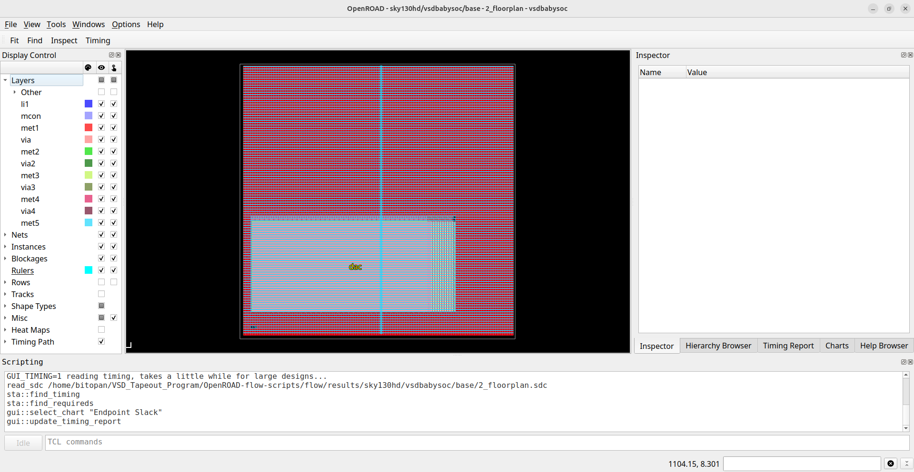
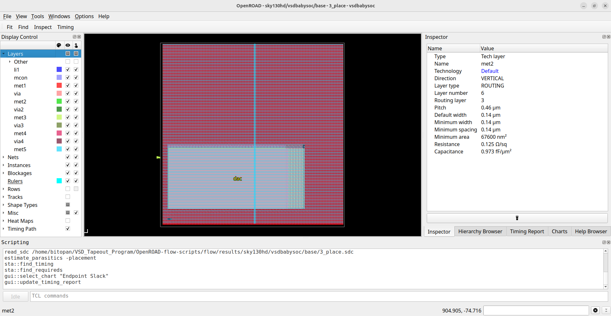
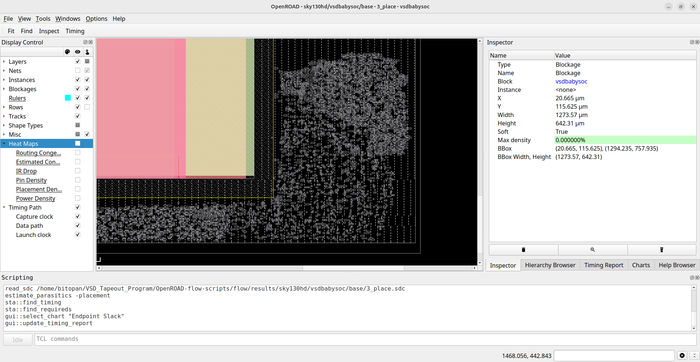
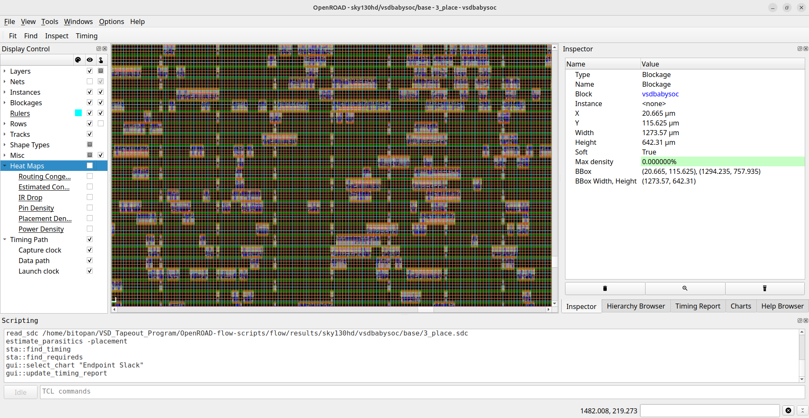
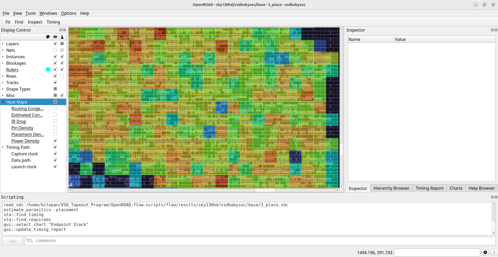
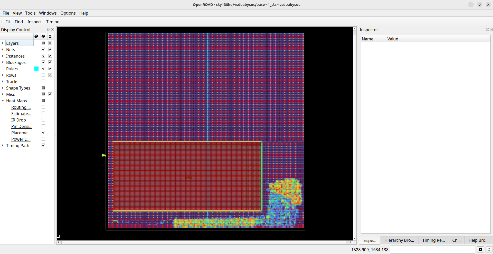
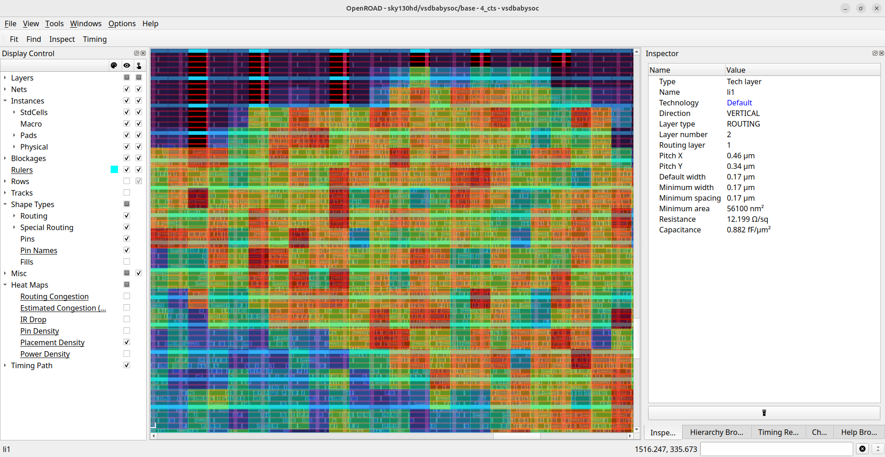
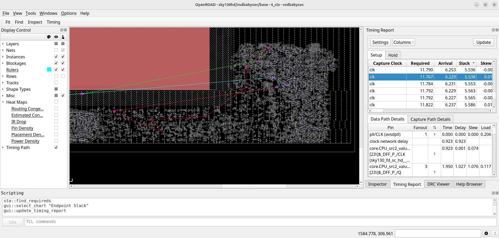

# Week 7: BabySoC Physical Design & Post-Route SPEF Generation 
 
Week 7 marks the shift from logical design to its physical realization. Using the OpenROAD flow, the BabySoC is taken through synthesis, floorplanning, placement, CTS, and routing, revealing how real-world constraints like congestion, pin access, and macro placement shape the final layout. The week concludes with generating the post-route SPEF file, capturing accurate interconnect parasitics essential for timing validation and signoff. This stage solidifies the design’s physical footprint and prepares it for deeper post-route analysis.

---

## 📜 Table of Contents
[📋 Prerequisites](#-prerequisites) <br>
[1. Overview of ORFS](#1-overview-of-orfs)<br>
[2. Environment Setup and File Organization](#2-environment-setup-and-file-organization)<br>
[3. Synthesis](#3-synthesis)<br>
[4. Floorplan](#4-floorplan)<br>
[5. Placement](#5-placement)<br>
[6. Clock Tree Synthesis (CTS)](#6-clock-tree-synthesis-cts)<br>
[7. Routing](#7-routing)<br>
[8. Introduction to Standard Parasitic Exchange Format](#8-introduction-to-standard-parasitic-exchange-format)<br>
[9. Post-Route SPEF Generation](#9-post-route-spef-generation)<br>
[⚠️ Challenges](#%EF%B8%8F-challenges)<br>
[🏁 Final Remarks](#-final-remarks)

---

## 📋 Prerequisites
- Basic understanding of Linux commands.
- Successful installation of the OpenROAD in [Week 5.](https://github.com/BitopanBaishya/RISC-V-SoC-Tapeout-Program-2025---Week-5)

---

## 1. Overview of ORFS
This document continues from the conclusion of Week 5.<br>
Following the successful build of the OpenROAD software, the subsequent work begins here.

### <ins>1. ORFS Directory Overview</ins>
OpenROAD is organized into several key directories, each serving a specific role within the OpenROAD and RTL-to-GDSII flow:<br><br>
`OpenROAD-flow-scripts/`: This directory contains the complete flow framework and supporting infrastructure for executing the OpenROAD RTL-to-GDSII flow.
- `docker/`: Contains Docker-based installation files, run scripts, and related components.
- `docs/`: Documentation for OpenROAD and its flow scripts.
- `flow/`: Core files required for running the full RTL-to-GDSII flow.
  * `design/`: Built-in RTL-to-GDSII examples across multiple technology nodes.
  * `makefile`: Automation layer enabling end-to-end flow execution.
  * `platform/`: Technology-specific libraries, LEF files, GDS files, and related resources.
  * `tutorials/`: Reference tutorials demonstrating usage of the flow.
  * `util/`: Helper utilities supporting various flow operations.
  * `scripts/`: Execution scripts used within the flow.
- `jenkins/`: Regression tests associated with build verification and updates.
- `tools/`: All essential tools required to execute the RTL-to-GDSII flow.
- `etc/`: Dependency installers and supporting configuration utilities.
- `setup_env.sh`: Environment setup script used to source OpenROAD rules prior to running the flow.

   <div align="center">
     
   </div>

### <ins>2. Environment Setup and File Organization</ins>
1. Create the two required `vsdbabysoc` design directories:<br>
   ```
   cd /OpenROAD-flow-scripts/flow/
   mkdir -p OpenROAD-flow-scripts/flow/designs/sky130hd/vsdbabysoc
   mkdir -p OpenROAD-flow-scripts/flow/designs/src/vsdbabysoc
   ```

   * **Purpose of the Newly Created Directories**<br>
     * `designs/sky130hd/vsdbabysoc/`: This directory stores all technology-dependent and platform-specific files required for the physical design flow on the Sky130 HD PDK. Contents include:
       * **LEF files** – Abstract layouts for hard macros
       * **LIB files** – Timing libraries for synthesis and STA
       * **GDS files** – Final layout geometries for macros
       * **SDC** – Synthesis constraints
       * **Configuration files** – macro.cfg, pin_order.cfg, config.mk
      * `designs/src/vsdbabysoc/`: This directory holds all logical design sources that remain independent of technology. Contents include:
        * Verilog RTL modules
        * Include headers (`.vh` files)
        * Additional source definitions required during synthesis
     
2. Copy the resource folders from the source location `VSDBabySoC/src` into the `OpenROAD-flow-scripts/flow/designs/sky130hd/vsdbabysoc/` directory you just created.<br>
   Expected contents:<br>
   - `gds/` should include: `avsddac.gds`, `avsdpll.gds`
   - `include/` should include: `sandpiper.vh`, `sandpiper_gen.vh`, `sp_default.vh`, `sp_verilog.vh`
   - `lef/` should include: `avsddac.lef`, `avsdpll.lef`
   - `lib/` should include: `avsddac.lib`, `avsdpll.lib`
3. Copy the SDC constraint file from the source `VSDBabySoC/src/sdc/` to the `OpenROAD-flow-scripts/flow/designs/sky130hd/vsdbabysoc/` directory.
4. Copy the layout configuration files (`macro.cfg` and `pin_order.cfg`) from `VSDBabySoC/src/layout_conf/vsdbabysoc` directory to the `OpenROAD-flow-scripts/flow/designs/sky130hd/vsdbabysoc/` directory.
5. Create a file named `config.mk` inside the `OpenROAD-flow-scripts/flow/designs/sky130hd/vsdbabysoc/` directory with the following contents:
   ```
   export DESIGN_NICKNAME = vsdbabysoc
   export DESIGN_NAME = vsdbabysoc
   export PLATFORM    = sky130hd

   # export VERILOG_FILES_BLACKBOX = $(DESIGN_HOME)/src/$(DESIGN_NICKNAME)/IPs/*.v
   # export VERILOG_FILES = $(sort $(wildcard $(DESIGN_HOME)/src/$(DESIGN_NICKNAME)/*.v))
   # Explicitly list the Verilog files for synthesis
   export VERILOG_FILES = $(DESIGN_HOME)/src/$(DESIGN_NICKNAME)/vsdbabysoc.v \
                          $(DESIGN_HOME)/src/$(DESIGN_NICKNAME)/rvmyth.v \
                          $(DESIGN_HOME)/src/$(DESIGN_NICKNAME)/clk_gate.v

   export SDC_FILE      = $(DESIGN_HOME)/$(PLATFORM)/$(DESIGN_NICKNAME)/vsdbabysoc_synthesis.sdc

   export vsdbabysoc_DIR = $(DESIGN_HOME)/$(PLATFORM)/$(DESIGN_NICKNAME)

   export VERILOG_INCLUDE_DIRS = $(wildcard $(vsdbabysoc_DIR)/include/)
   # export SDC_FILE      = $(wildcard $(vsdbabysoc_DIR)/sdc/*.sdc)
   export ADDITIONAL_GDS  = $(wildcard $(vsdbabysoc_DIR)/gds/*.gds.gz)
   export ADDITIONAL_LEFS  = $(wildcard $(vsdbabysoc_DIR)/lef/*.lef)
   export ADDITIONAL_LIBS = $(wildcard $(vsdbabysoc_DIR)/lib/*.lib)
   # export PDN_TCL = $(DESIGN_HOME)/$(PLATFORM)/$(DESIGN_NICKNAME)/pdn.tcl

   # Clock Configuration (vsdbabysoc specific)
   # export CLOCK_PERIOD = 20.0
   export CLOCK_PORT = CLK
   export CLOCK_NET = $(CLOCK_PORT)

   # Floorplanning Configuration (vsdbabysoc specific)
   export FP_PIN_ORDER_CFG = $(wildcard $(DESIGN_DIR)/pin_order.cfg)
   # export FP_SIZING = absolute

   export DIE_AREA   = 0 0 1600 1600
   export CORE_AREA  = 20 20 1590 1590

   # Placement Configuration (vsdbabysoc specific)
   export MACRO_PLACEMENT_CFG = $(wildcard $(DESIGN_DIR)/macro.cfg)
   export PLACE_PINS_ARGS = -exclude left:0-600 -exclude left:1000-1600: -exclude right:* -exclude top:* -exclude bottom:*
   # export MACRO_PLACEMENT = $(DESIGN_HOME)/$(PLATFORM)/$(DESIGN_NICKNAME)/macro_placement.cfg

   export TNS_END_PERCENT = 100
   export REMOVE_ABC_BUFFERS = 1

   # Magic Tool Configuration
   export MAGIC_ZEROIZE_ORIGIN = 0
   export MAGIC_EXT_USE_GDS = 1

   # CTS tuning
   export CTS_BUF_DISTANCE = 600
   export SKIP_GATE_CLONING = 1

   # export CORE_UTILIZATION=0.1  # Reduce this value to allow more whitespace for routing.
   ```

6. Now copy the following files from `VSDBabySoC/src/module/` to `OpenROAD-flow-scripts/flow/designs/src/vsdbabysoc`:
   * `vsdbabysoc.v`
   * `rvmyth.v`
   * `rvmyth_gen.v`
   * `clk_gate.v`
   * `avsddac.v`
   * `avsdpll.v`
8. The final structure of directories and files should look like below:
   ```
   designs/
   ├── src/vsdbabysoc/
   │           ├── vsdbabysoc.v
   │           ├── rvmyth.v
   │           ├── rvmyth_gen.v
   │           ├── clk_gate.v
   │           ├── avsddac.v
   │           └── avsdpll.v
   └── sky130hd/vsdbabysoc/
                    ├── gds/
                    │   ├── avsddac.gds
                    │   └── avsdpll.gds
                    ├── lef/
                    │   ├── avsddac.lef
                    │   └── avsdpll.lef
                    ├── lib/
                    │   ├── avsddac.lib
                    │   └── avsdpll.lib
                    └── include/
                    │   ├── sandpiper.vh
                    │   ├── sandpiper_gen.vh
                    │   ├── sp_default.vh
                    │   └── sp_verilog.vh
                    ├── macro.cfg
                    ├── pin_order.cfg
                    ├── config.mk
                    └── vsdbabysoc_synthesis.sdc
   ```

---

## 3. Synthesis

### <ins>1. Commands</ins>
First run the following commands:
```
cd OpenROAD-flow-scripts
source env.sh
cd flow
```

Now, execute synthesis:
```
make DESIGN_CONFIG=./designs/sky130hd/vsdbabysoc/config.mk synth
```

### <ins>2. Execution of Synthesis in the Terminal</ins>
<div align="center">

</div>
<div align="center">

</div>

### <ins>3. Synthesized Netlist</ins>
<div align="center">

</div>

### <ins>4. Synthesis Log</ins>
<div align="center">

</div>

### <ins>5. Synthesis Check</ins>
<div align="center">

</div>

### <ins>6. Synthesis Stats</ins>
<div align="center">

</div>
<div align="center">

</div>
<div align="center">

</div>

---

## 4. Floorplan
### <ins>1. Commands</ins>
Now, execute floorplan:
```
make DESIGN_CONFIG=./designs/sky130hd/vsdbabysoc/config.mk floorplan
```

### <ins>2. Execution of Floorplan in the Terminal</ins>
<div align="center">

</div>
<div align="center">

</div>
<div align="center">

</div>

### <ins>3. Visualize Floorplan</ins>
```
make DESIGN_CONFIG=./designs/sky130hd/vsdbabysoc/config.mk gui_floorplan
```
<div align="center">

</div>

<div align="center">

</div>

---

## 5. Placement
### <ins>1. Commands</ins>
Now, execute floorplan:
```
make DESIGN_CONFIG=./designs/sky130hd/vsdbabysoc/config.mk place
```

### <ins>2. Execution of Placement in the Terminal</ins>
<div align="center">

</div>
<div align="center">

</div>

### <ins>3. Visualize Floorplan</ins>
```
make DESIGN_CONFIG=./designs/sky130hd/vsdbabysoc/config.mk gui_place
```

<div align="center">

</div>
<div align="center">

</div>

Heatmap:
<div align="center">

</div>

Zooming into the different parts:
<div align="center">

</div>
<div align="center">

</div>
<div align="center">

</div>
<div align="center">

</div>

---

## 6. Clock Tree Synthesis (CTS)
### <ins>1. Commands</ins>
Now, execute cts:
```
make DESIGN_CONFIG=./designs/sky130hd/vsdbabysoc/config.mk cts
```

### <ins>2. Execution of CTS in the Terminal</ins>
<div align="center">

</div>
<div align="center">

</div>

### <ins>3. Visualize CTS</ins>
```
make DESIGN_CONFIG=./designs/sky130hd/vsdbabysoc/config.mk gui_cts
```

<div align="center">

</div>
<div align="center">

</div>
<div align="center">

</div>
<div align="center">

</div>

### <ins>4. Final CTS Report</ins>
```
==========================================================================
cts final report_tns
--------------------------------------------------------------------------
tns max 0.00

==========================================================================
cts final report_wns
--------------------------------------------------------------------------
wns max 0.00

==========================================================================
cts final report_worst_slack
--------------------------------------------------------------------------
worst slack max 5.31

==========================================================================
cts final report_clock_min_period
--------------------------------------------------------------------------
clk period_min = 5.69 fmax = 175.83

==========================================================================
cts final report_clock_skew
--------------------------------------------------------------------------
Clock clk
   0.97 source latency core.CPU_src2_value_a4[28]$_DFF_P_/CLK ^
  -0.86 target latency core.CPU_Dmem_value_a5[14][28]$_SDFFE_PP0P_/CLK ^
   0.00 CRPR
--------------
   0.11 setup skew


==========================================================================
cts final report_checks -path_delay min
--------------------------------------------------------------------------
Startpoint: core.CPU_rd_a2[4]$_DFF_P_
            (rising edge-triggered flip-flop clocked by clk)
Endpoint: core.CPU_rd_a3[4]$_DFF_P_
          (rising edge-triggered flip-flop clocked by clk)
Path Group: clk
Path Type: min

Fanout     Cap    Slew   Delay    Time   Description
-----------------------------------------------------------------------------
                          0.00    0.00   clock clk (rise edge)
                          0.00    0.00   clock source latency
     1    0.21    0.00    0.00    0.00 ^ pll/CLK (avsdpll)
                                         CLK (net)
                  0.02    0.01    0.01 ^ clkbuf_0_CLK/A (sky130_fd_sc_hd__clkbuf_16)
     8    0.35    0.36    0.34    0.36 ^ clkbuf_0_CLK/X (sky130_fd_sc_hd__clkbuf_16)
                                         clknet_0_CLK (net)
                  0.36    0.02    0.37 ^ clkbuf_3_6__f_CLK/A (sky130_fd_sc_hd__clkbuf_16)
    10    0.17    0.19    0.33    0.70 ^ clkbuf_3_6__f_CLK/X (sky130_fd_sc_hd__clkbuf_16)
                                         clknet_3_6__leaf_CLK (net)
                  0.19    0.00    0.70 ^ clkbuf_leaf_9_CLK/A (sky130_fd_sc_hd__clkbuf_16)
    18    0.06    0.08    0.20    0.91 ^ clkbuf_leaf_9_CLK/X (sky130_fd_sc_hd__clkbuf_16)
                                         clknet_leaf_9_CLK (net)
                  0.08    0.00    0.91 ^ core.CPU_rd_a2[4]$_DFF_P_/CLK (sky130_fd_sc_hd__dfxtp_1)
     1    0.00    0.04    0.31    1.22 ^ core.CPU_rd_a2[4]$_DFF_P_/Q (sky130_fd_sc_hd__dfxtp_1)
                                         core.CPU_rd_a2[4] (net)
                  0.04    0.00    1.22 ^ core.CPU_rd_a3[4]$_DFF_P_/D (sky130_fd_sc_hd__dfxtp_1)
                                  1.22   data arrival time

                          0.00    0.00   clock clk (rise edge)
                          0.00    0.00   clock source latency
     1    0.21    0.00    0.00    0.00 ^ pll/CLK (avsdpll)
                                         CLK (net)
                  0.02    0.01    0.01 ^ clkbuf_0_CLK/A (sky130_fd_sc_hd__clkbuf_16)
     8    0.35    0.36    0.34    0.36 ^ clkbuf_0_CLK/X (sky130_fd_sc_hd__clkbuf_16)
                                         clknet_0_CLK (net)
                  0.36    0.02    0.37 ^ clkbuf_3_7__f_CLK/A (sky130_fd_sc_hd__clkbuf_16)
    13    0.19    0.21    0.34    0.71 ^ clkbuf_3_7__f_CLK/X (sky130_fd_sc_hd__clkbuf_16)
                                         clknet_3_7__leaf_CLK (net)
                  0.21    0.00    0.72 ^ clkbuf_leaf_8_CLK/A (sky130_fd_sc_hd__clkbuf_16)
    17    0.06    0.08    0.21    0.93 ^ clkbuf_leaf_8_CLK/X (sky130_fd_sc_hd__clkbuf_16)
                                         clknet_leaf_8_CLK (net)
                  0.08    0.00    0.93 ^ core.CPU_rd_a3[4]$_DFF_P_/CLK (sky130_fd_sc_hd__dfxtp_1)
                          0.00    0.93   clock reconvergence pessimism
                         -0.03    0.90   library hold time
                                  0.90   data required time
-----------------------------------------------------------------------------
                                  0.90   data required time
                                 -1.22   data arrival time
-----------------------------------------------------------------------------
                                  0.32   slack (MET)


==========================================================================
cts final report_checks -path_delay max
--------------------------------------------------------------------------
Startpoint: core.CPU_src2_value_a3[22]$_DFF_P_
            (rising edge-triggered flip-flop clocked by clk)
Endpoint: core.CPU_Xreg_value_a4[27][29]$_SDFFE_PP0P_
          (rising edge-triggered flip-flop clocked by clk)
Path Group: clk
Path Type: max

Fanout     Cap    Slew   Delay    Time   Description
-----------------------------------------------------------------------------
                          0.00    0.00   clock clk (rise edge)
                          0.00    0.00   clock source latency
     1    0.21    0.00    0.00    0.00 ^ pll/CLK (avsdpll)
                                         CLK (net)
                  0.02    0.01    0.01 ^ clkbuf_0_CLK/A (sky130_fd_sc_hd__clkbuf_16)
     8    0.35    0.36    0.34    0.36 ^ clkbuf_0_CLK/X (sky130_fd_sc_hd__clkbuf_16)
                                         clknet_0_CLK (net)
                  0.36    0.02    0.37 ^ clkbuf_3_6__f_CLK/A (sky130_fd_sc_hd__clkbuf_16)
    10    0.17    0.19    0.33    0.70 ^ clkbuf_3_6__f_CLK/X (sky130_fd_sc_hd__clkbuf_16)
                                         clknet_3_6__leaf_CLK (net)
                  0.19    0.00    0.70 ^ clkbuf_leaf_24_CLK/A (sky130_fd_sc_hd__clkbuf_16)
     5    0.05    0.07    0.20    0.90 ^ clkbuf_leaf_24_CLK/X (sky130_fd_sc_hd__clkbuf_16)
                                         clknet_leaf_24_CLK (net)
                  0.07    0.00    0.90 ^ core.CPU_src2_value_a3[22]$_DFF_P_/CLK (sky130_fd_sc_hd__dfxtp_1)
     3    0.12    1.09    1.04    1.94 ^ core.CPU_src2_value_a3[22]$_DFF_P_/Q (sky130_fd_sc_hd__dfxtp_1)
                                         core.CPU_src2_value_a3[22] (net)
                  1.09    0.03    1.97 ^ _05544_/A (sky130_fd_sc_hd__inv_1)
     1    0.00    0.15    0.11    2.08 v _05544_/Y (sky130_fd_sc_hd__inv_1)
                                         _00158_ (net)
                  0.15    0.00    2.08 v _10861_/B (sky130_fd_sc_hd__ha_1)
    12    0.07    0.60    0.72    2.79 ^ _10861_/SUM (sky130_fd_sc_hd__ha_1)
                                         _00160_ (net)
                  0.60    0.00    2.80 ^ _08166_/A (sky130_fd_sc_hd__inv_1)
     3    0.01    0.14    0.15    2.95 v _08166_/Y (sky130_fd_sc_hd__inv_1)
                                         _03244_ (net)
                  0.14    0.00    2.95 v _08168_/A2 (sky130_fd_sc_hd__a21oi_1)
     5    0.04    0.72    0.63    3.57 ^ _08168_/Y (sky130_fd_sc_hd__a21oi_1)
                                         _03246_ (net)
                  0.72    0.00    3.57 ^ _08419_/A1 (sky130_fd_sc_hd__o211ai_1)
     1    0.01    0.19    0.27    3.84 v _08419_/Y (sky130_fd_sc_hd__o211ai_1)
                                         _03491_ (net)
                  0.19    0.00    3.84 v _08423_/B1 (sky130_fd_sc_hd__a221o_1)
     3    0.02    0.11    0.41    4.25 v _08423_/X (sky130_fd_sc_hd__a221o_1)
                                         _03495_ (net)
                  0.11    0.00    4.25 v _08425_/A (sky130_fd_sc_hd__nor2_1)
     1    0.00    0.11    0.14    4.39 ^ _08425_/Y (sky130_fd_sc_hd__nor2_1)
                                         _03497_ (net)
                  0.11    0.00    4.39 ^ _08430_/A3 (sky130_fd_sc_hd__a31oi_1)
     1    0.01    0.26    0.16    4.55 v _08430_/Y (sky130_fd_sc_hd__a31oi_1)
                                         _03502_ (net)
                  0.26    0.00    4.55 v _08434_/A2 (sky130_fd_sc_hd__a31oi_1)
     1    0.06    1.31    1.10    5.66 ^ _08434_/Y (sky130_fd_sc_hd__a31oi_1)
                                         _03506_ (net)
                  1.31    0.01    5.67 ^ place321/A (sky130_fd_sc_hd__buf_4)
     3    0.01    0.07    0.27    5.94 ^ place321/X (sky130_fd_sc_hd__buf_4)
                                         net320 (net)
                  0.07    0.00    5.94 ^ _08450_/A2 (sky130_fd_sc_hd__o31ai_1)
     2    0.01    0.12    0.10    6.03 v _08450_/Y (sky130_fd_sc_hd__o31ai_1)
                                         _03522_ (net)
                  0.12    0.00    6.03 v _08451_/B (sky130_fd_sc_hd__nand2_1)
    10    0.03    0.29    0.27    6.30 ^ _08451_/Y (sky130_fd_sc_hd__nand2_1)
                                         _03523_ (net)
                  0.29    0.00    6.30 ^ _09231_/A1 (sky130_fd_sc_hd__o21ai_0)
     1    0.00    0.12    0.15    6.45 v _09231_/Y (sky130_fd_sc_hd__o21ai_0)
                                         _00965_ (net)
                  0.12    0.00    6.45 v core.CPU_Xreg_value_a4[27][29]$_SDFFE_PP0P_/D (sky130_fd_sc_hd__dfxtp_1)
                                  6.45   data arrival time

                         11.00   11.00   clock clk (rise edge)
                          0.00   11.00   clock source latency
     1    0.21    0.00    0.00   11.00 ^ pll/CLK (avsdpll)
                                         CLK (net)
                  0.02    0.01   11.01 ^ clkbuf_0_CLK/A (sky130_fd_sc_hd__clkbuf_16)
     8    0.35    0.36    0.34   11.36 ^ clkbuf_0_CLK/X (sky130_fd_sc_hd__clkbuf_16)
                                         clknet_0_CLK (net)
                  0.36    0.02   11.37 ^ clkbuf_3_5__f_CLK/A (sky130_fd_sc_hd__clkbuf_16)
    11    0.18    0.19    0.33   11.70 ^ clkbuf_3_5__f_CLK/X (sky130_fd_sc_hd__clkbuf_16)
                                         clknet_3_5__leaf_CLK (net)
                  0.19    0.00   11.70 ^ clkbuf_leaf_31_CLK/A (sky130_fd_sc_hd__clkbuf_16)
    12    0.05    0.07    0.20   11.90 ^ clkbuf_leaf_31_CLK/X (sky130_fd_sc_hd__clkbuf_16)
                                         clknet_leaf_31_CLK (net)
                  0.07    0.00   11.90 ^ core.CPU_Xreg_value_a4[27][29]$_SDFFE_PP0P_/CLK (sky130_fd_sc_hd__dfxtp_1)
                          0.00   11.90   clock reconvergence pessimism
                         -0.14   11.76   library setup time
                                 11.76   data required time
-----------------------------------------------------------------------------
                                 11.76   data required time
                                 -6.45   data arrival time
-----------------------------------------------------------------------------
                                  5.31   slack (MET)


==========================================================================
cts final report_checks -unconstrained
--------------------------------------------------------------------------
Startpoint: core.CPU_src2_value_a3[22]$_DFF_P_
            (rising edge-triggered flip-flop clocked by clk)
Endpoint: core.CPU_Xreg_value_a4[27][29]$_SDFFE_PP0P_
          (rising edge-triggered flip-flop clocked by clk)
Path Group: clk
Path Type: max

Fanout     Cap    Slew   Delay    Time   Description
-----------------------------------------------------------------------------
                          0.00    0.00   clock clk (rise edge)
                          0.00    0.00   clock source latency
     1    0.21    0.00    0.00    0.00 ^ pll/CLK (avsdpll)
                                         CLK (net)
                  0.02    0.01    0.01 ^ clkbuf_0_CLK/A (sky130_fd_sc_hd__clkbuf_16)
     8    0.35    0.36    0.34    0.36 ^ clkbuf_0_CLK/X (sky130_fd_sc_hd__clkbuf_16)
                                         clknet_0_CLK (net)
                  0.36    0.02    0.37 ^ clkbuf_3_6__f_CLK/A (sky130_fd_sc_hd__clkbuf_16)
    10    0.17    0.19    0.33    0.70 ^ clkbuf_3_6__f_CLK/X (sky130_fd_sc_hd__clkbuf_16)
                                         clknet_3_6__leaf_CLK (net)
                  0.19    0.00    0.70 ^ clkbuf_leaf_24_CLK/A (sky130_fd_sc_hd__clkbuf_16)
     5    0.05    0.07    0.20    0.90 ^ clkbuf_leaf_24_CLK/X (sky130_fd_sc_hd__clkbuf_16)
                                         clknet_leaf_24_CLK (net)
                  0.07    0.00    0.90 ^ core.CPU_src2_value_a3[22]$_DFF_P_/CLK (sky130_fd_sc_hd__dfxtp_1)
     3    0.12    1.09    1.04    1.94 ^ core.CPU_src2_value_a3[22]$_DFF_P_/Q (sky130_fd_sc_hd__dfxtp_1)
                                         core.CPU_src2_value_a3[22] (net)
                  1.09    0.03    1.97 ^ _05544_/A (sky130_fd_sc_hd__inv_1)
     1    0.00    0.15    0.11    2.08 v _05544_/Y (sky130_fd_sc_hd__inv_1)
                                         _00158_ (net)
                  0.15    0.00    2.08 v _10861_/B (sky130_fd_sc_hd__ha_1)
    12    0.07    0.60    0.72    2.79 ^ _10861_/SUM (sky130_fd_sc_hd__ha_1)
                                         _00160_ (net)
                  0.60    0.00    2.80 ^ _08166_/A (sky130_fd_sc_hd__inv_1)
     3    0.01    0.14    0.15    2.95 v _08166_/Y (sky130_fd_sc_hd__inv_1)
                                         _03244_ (net)
                  0.14    0.00    2.95 v _08168_/A2 (sky130_fd_sc_hd__a21oi_1)
     5    0.04    0.72    0.63    3.57 ^ _08168_/Y (sky130_fd_sc_hd__a21oi_1)
                                         _03246_ (net)
                  0.72    0.00    3.57 ^ _08419_/A1 (sky130_fd_sc_hd__o211ai_1)
     1    0.01    0.19    0.27    3.84 v _08419_/Y (sky130_fd_sc_hd__o211ai_1)
                                         _03491_ (net)
                  0.19    0.00    3.84 v _08423_/B1 (sky130_fd_sc_hd__a221o_1)
     3    0.02    0.11    0.41    4.25 v _08423_/X (sky130_fd_sc_hd__a221o_1)
                                         _03495_ (net)
                  0.11    0.00    4.25 v _08425_/A (sky130_fd_sc_hd__nor2_1)
     1    0.00    0.11    0.14    4.39 ^ _08425_/Y (sky130_fd_sc_hd__nor2_1)
                                         _03497_ (net)
                  0.11    0.00    4.39 ^ _08430_/A3 (sky130_fd_sc_hd__a31oi_1)
     1    0.01    0.26    0.16    4.55 v _08430_/Y (sky130_fd_sc_hd__a31oi_1)
                                         _03502_ (net)
                  0.26    0.00    4.55 v _08434_/A2 (sky130_fd_sc_hd__a31oi_1)
     1    0.06    1.31    1.10    5.66 ^ _08434_/Y (sky130_fd_sc_hd__a31oi_1)
                                         _03506_ (net)
                  1.31    0.01    5.67 ^ place321/A (sky130_fd_sc_hd__buf_4)
     3    0.01    0.07    0.27    5.94 ^ place321/X (sky130_fd_sc_hd__buf_4)
                                         net320 (net)
                  0.07    0.00    5.94 ^ _08450_/A2 (sky130_fd_sc_hd__o31ai_1)
     2    0.01    0.12    0.10    6.03 v _08450_/Y (sky130_fd_sc_hd__o31ai_1)
                                         _03522_ (net)
                  0.12    0.00    6.03 v _08451_/B (sky130_fd_sc_hd__nand2_1)
    10    0.03    0.29    0.27    6.30 ^ _08451_/Y (sky130_fd_sc_hd__nand2_1)
                                         _03523_ (net)
                  0.29    0.00    6.30 ^ _09231_/A1 (sky130_fd_sc_hd__o21ai_0)
     1    0.00    0.12    0.15    6.45 v _09231_/Y (sky130_fd_sc_hd__o21ai_0)
                                         _00965_ (net)
                  0.12    0.00    6.45 v core.CPU_Xreg_value_a4[27][29]$_SDFFE_PP0P_/D (sky130_fd_sc_hd__dfxtp_1)
                                  6.45   data arrival time

                         11.00   11.00   clock clk (rise edge)
                          0.00   11.00   clock source latency
     1    0.21    0.00    0.00   11.00 ^ pll/CLK (avsdpll)
                                         CLK (net)
                  0.02    0.01   11.01 ^ clkbuf_0_CLK/A (sky130_fd_sc_hd__clkbuf_16)
     8    0.35    0.36    0.34   11.36 ^ clkbuf_0_CLK/X (sky130_fd_sc_hd__clkbuf_16)
                                         clknet_0_CLK (net)
                  0.36    0.02   11.37 ^ clkbuf_3_5__f_CLK/A (sky130_fd_sc_hd__clkbuf_16)
    11    0.18    0.19    0.33   11.70 ^ clkbuf_3_5__f_CLK/X (sky130_fd_sc_hd__clkbuf_16)
                                         clknet_3_5__leaf_CLK (net)
                  0.19    0.00   11.70 ^ clkbuf_leaf_31_CLK/A (sky130_fd_sc_hd__clkbuf_16)
    12    0.05    0.07    0.20   11.90 ^ clkbuf_leaf_31_CLK/X (sky130_fd_sc_hd__clkbuf_16)
                                         clknet_leaf_31_CLK (net)
                  0.07    0.00   11.90 ^ core.CPU_Xreg_value_a4[27][29]$_SDFFE_PP0P_/CLK (sky130_fd_sc_hd__dfxtp_1)
                          0.00   11.90   clock reconvergence pessimism
                         -0.14   11.76   library setup time
                                 11.76   data required time
-----------------------------------------------------------------------------
                                 11.76   data required time
                                 -6.45   data arrival time
-----------------------------------------------------------------------------
                                  5.31   slack (MET)


==========================================================================
cts final report_check_types -max_slew -max_cap -max_fanout -violators
--------------------------------------------------------------------------

==========================================================================
cts final max_slew_check_slack
--------------------------------------------------------------------------
0.03764066845178604

==========================================================================
cts final max_slew_check_limit
--------------------------------------------------------------------------
1.510388970375061

==========================================================================
cts final max_slew_check_slack_limit
--------------------------------------------------------------------------
0.0249

==========================================================================
cts final max_fanout_check_slack
--------------------------------------------------------------------------
1.0000000150474662e+30

==========================================================================
cts final max_fanout_check_limit
--------------------------------------------------------------------------
1.0000000150474662e+30

==========================================================================
cts final max_capacitance_check_slack
--------------------------------------------------------------------------
0.0011702997144311666

==========================================================================
cts final max_capacitance_check_limit
--------------------------------------------------------------------------
0.021067000925540924

==========================================================================
cts final max_capacitance_check_slack_limit
--------------------------------------------------------------------------
0.0556

==========================================================================
cts final max_slew_violation_count
--------------------------------------------------------------------------
max slew violation count 0

==========================================================================
cts final max_fanout_violation_count
--------------------------------------------------------------------------
max fanout violation count 0

==========================================================================
cts final max_cap_violation_count
--------------------------------------------------------------------------
max cap violation count 0

==========================================================================
cts final setup_violation_count
--------------------------------------------------------------------------
setup violation count 0

==========================================================================
cts final hold_violation_count
--------------------------------------------------------------------------
hold violation count 0

==========================================================================
cts final report_checks -path_delay max reg to reg
--------------------------------------------------------------------------
Startpoint: core.CPU_src2_value_a3[22]$_DFF_P_
            (rising edge-triggered flip-flop clocked by clk)
Endpoint: core.CPU_Xreg_value_a4[27][29]$_SDFFE_PP0P_
          (rising edge-triggered flip-flop clocked by clk)
Path Group: clk
Path Type: max

  Delay    Time   Description
---------------------------------------------------------
   0.00    0.00   clock clk (rise edge)
   0.00    0.00   clock source latency
   0.00    0.00 ^ pll/CLK (avsdpll)
   0.36    0.36 ^ clkbuf_0_CLK/X (sky130_fd_sc_hd__clkbuf_16)
   0.35    0.70 ^ clkbuf_3_6__f_CLK/X (sky130_fd_sc_hd__clkbuf_16)
   0.20    0.90 ^ clkbuf_leaf_24_CLK/X (sky130_fd_sc_hd__clkbuf_16)
   0.00    0.90 ^ core.CPU_src2_value_a3[22]$_DFF_P_/CLK (sky130_fd_sc_hd__dfxtp_1)
   1.04    1.94 ^ core.CPU_src2_value_a3[22]$_DFF_P_/Q (sky130_fd_sc_hd__dfxtp_1)
   0.14    2.08 v _05544_/Y (sky130_fd_sc_hd__inv_1)
   0.72    2.79 ^ _10861_/SUM (sky130_fd_sc_hd__ha_1)
   0.15    2.95 v _08166_/Y (sky130_fd_sc_hd__inv_1)
   0.63    3.57 ^ _08168_/Y (sky130_fd_sc_hd__a21oi_1)
   0.27    3.84 v _08419_/Y (sky130_fd_sc_hd__o211ai_1)
   0.41    4.25 v _08423_/X (sky130_fd_sc_hd__a221o_1)
   0.14    4.39 ^ _08425_/Y (sky130_fd_sc_hd__nor2_1)
   0.16    4.55 v _08430_/Y (sky130_fd_sc_hd__a31oi_1)
   1.10    5.66 ^ _08434_/Y (sky130_fd_sc_hd__a31oi_1)
   0.28    5.94 ^ place321/X (sky130_fd_sc_hd__buf_4)
   0.10    6.03 v _08450_/Y (sky130_fd_sc_hd__o31ai_1)
   0.27    6.30 ^ _08451_/Y (sky130_fd_sc_hd__nand2_1)
   0.15    6.45 v _09231_/Y (sky130_fd_sc_hd__o21ai_0)
   0.00    6.45 v core.CPU_Xreg_value_a4[27][29]$_SDFFE_PP0P_/D (sky130_fd_sc_hd__dfxtp_1)
           6.45   data arrival time

  11.00   11.00   clock clk (rise edge)
   0.00   11.00   clock source latency
   0.00   11.00 ^ pll/CLK (avsdpll)
   0.36   11.36 ^ clkbuf_0_CLK/X (sky130_fd_sc_hd__clkbuf_16)
   0.34   11.70 ^ clkbuf_3_5__f_CLK/X (sky130_fd_sc_hd__clkbuf_16)
   0.20   11.90 ^ clkbuf_leaf_31_CLK/X (sky130_fd_sc_hd__clkbuf_16)
   0.00   11.90 ^ core.CPU_Xreg_value_a4[27][29]$_SDFFE_PP0P_/CLK (sky130_fd_sc_hd__dfxtp_1)
   0.00   11.90   clock reconvergence pessimism
  -0.14   11.76   library setup time
          11.76   data required time
---------------------------------------------------------
          11.76   data required time
          -6.45   data arrival time
---------------------------------------------------------
           5.31   slack (MET)


==========================================================================
cts final report_checks -path_delay min reg to reg
--------------------------------------------------------------------------
Startpoint: core.CPU_rd_a2[4]$_DFF_P_
            (rising edge-triggered flip-flop clocked by clk)
Endpoint: core.CPU_rd_a3[4]$_DFF_P_
          (rising edge-triggered flip-flop clocked by clk)
Path Group: clk
Path Type: min

  Delay    Time   Description
---------------------------------------------------------
   0.00    0.00   clock clk (rise edge)
   0.00    0.00   clock source latency
   0.00    0.00 ^ pll/CLK (avsdpll)
   0.36    0.36 ^ clkbuf_0_CLK/X (sky130_fd_sc_hd__clkbuf_16)
   0.35    0.70 ^ clkbuf_3_6__f_CLK/X (sky130_fd_sc_hd__clkbuf_16)
   0.21    0.91 ^ clkbuf_leaf_9_CLK/X (sky130_fd_sc_hd__clkbuf_16)
   0.00    0.91 ^ core.CPU_rd_a2[4]$_DFF_P_/CLK (sky130_fd_sc_hd__dfxtp_1)
   0.31    1.22 ^ core.CPU_rd_a2[4]$_DFF_P_/Q (sky130_fd_sc_hd__dfxtp_1)
   0.00    1.22 ^ core.CPU_rd_a3[4]$_DFF_P_/D (sky130_fd_sc_hd__dfxtp_1)
           1.22   data arrival time

   0.00    0.00   clock clk (rise edge)
   0.00    0.00   clock source latency
   0.00    0.00 ^ pll/CLK (avsdpll)
   0.36    0.36 ^ clkbuf_0_CLK/X (sky130_fd_sc_hd__clkbuf_16)
   0.36    0.71 ^ clkbuf_3_7__f_CLK/X (sky130_fd_sc_hd__clkbuf_16)
   0.21    0.93 ^ clkbuf_leaf_8_CLK/X (sky130_fd_sc_hd__clkbuf_16)
   0.00    0.93 ^ core.CPU_rd_a3[4]$_DFF_P_/CLK (sky130_fd_sc_hd__dfxtp_1)
   0.00    0.93   clock reconvergence pessimism
  -0.03    0.90   library hold time
           0.90   data required time
---------------------------------------------------------
           0.90   data required time
          -1.22   data arrival time
---------------------------------------------------------
           0.32   slack (MET)


==========================================================================
cts final critical path target clock latency max path
--------------------------------------------------------------------------
0

==========================================================================
cts final critical path target clock latency min path
--------------------------------------------------------------------------
0

==========================================================================
cts final critical path source clock latency min path
--------------------------------------------------------------------------
0

==========================================================================
cts final critical path delay
--------------------------------------------------------------------------
6.4490

==========================================================================
cts final critical path slack
--------------------------------------------------------------------------
5.3127

==========================================================================
cts final slack div critical path delay
--------------------------------------------------------------------------
82.380214

==========================================================================
cts final report_power
--------------------------------------------------------------------------
Group                  Internal  Switching    Leakage      Total
                          Power      Power      Power      Power (Watts)
----------------------------------------------------------------
Sequential             4.36e-03   4.18e-04   9.27e-09   4.78e-03  39.5%
Combinational          9.85e-04   2.77e-03   1.03e-08   3.75e-03  31.0%
Clock                  1.71e-03   1.87e-03   1.44e-09   3.58e-03  29.6%
Macro                  0.00e+00   0.00e+00   0.00e+00   0.00e+00   0.0%
Pad                    0.00e+00   0.00e+00   0.00e+00   0.00e+00   0.0%
----------------------------------------------------------------
Total                  7.06e-03   5.05e-03   2.10e-08   1.21e-02 100.0%
                          58.3%      41.7%       0.0%
```

---

## 7. Routing
> [!CAUTION]
> The routing stage initially encountered several congestion-related challenges. In this section, I present only the final routing results obtained after resolving those issues. However, it is likely that similar congestion problems may arise during your own routing attempts. For reference, I have documented the complete debugging process I went through [here](#%EF%B8%8F-challenges), which you may review for guidance.


### <ins>1. Commands</ins>
Now, execute routing:
```
make DESIGN_CONFIG=./designs/sky130hd/vsdbabysoc/config.mk route
```

### <ins>2. Execution of Routing in the Terminal</ins>
<div align="center">

</div>
<div align="center">

</div>

### <ins>3. Visualize Routing</ins>
```
make DESIGN_CONFIG=./designs/sky130hd/vsdbabysoc/config.mk gui_route
```
<div align="center">

</div>

The final routed layout:
<div align="center">

</div>
<div align="center">

</div>
<div align="center">

</div>

---

## 8. Introduction to Standard Parasitic Exchange Format

### <ins>1. What Is SPEF?</ins>
The Standard Parasitic Exchange Format (SPEF) is an industry-standard file format used to represent the parasitic resistance (R) and capacitance (C) extracted from a chip’s physical layout. These parasitics arise from the actual geometry of interconnects—metal wires, vias, and routing layers—that connect various logic elements on silicon. Once placement and routing are completed, the SPEF file becomes the authoritative source for modeling how these physical interconnects affect signal delay, waveform shape, and overall timing behavior.

SPEF ensures a consistent, tool-independent way to store and communicate parasitic data across EDA tools. Timing analysis engines like OpenSTA, synthesis optimizers, and signoff tools rely heavily on SPEF because it accurately reflects real interconnect effects that were not present at the RTL or synthesis stages. This makes SPEF a crucial component of any post-route timing closure process.

In essence, SPEF captures the “hidden physics” of the chip—the resistive and capacitive loading introduced by real wires—allowing timing tools to compute delays that match silicon behavior rather than idealized models.

### <ins>2. Why Parasitics Matter in VLSI</ins>
In modern VLSI design, interconnect parasitics—specifically resistance (R) and capacitance (C)—play a dominant role in determining the performance and reliability of a chip. As feature sizes shrink and routing complexity increases, wires no longer behave as ideal conductors. Instead, they introduce delays, distort waveforms, and create unwanted interactions between signals.

- **Impact of Resistance (R):**<br>
  Metal wires exhibit finite resistance, which slows down signal transitions as they propagate through long or narrow routes. Higher resistance leads to:
  * Increased propagation delay
  * Degraded signal edges (slew deterioration)
  * Greater vulnerability to IR drop on power networks

- **Impact of Capacitance (C):**<br>
  Every routed net has capacitance associated with it, both to ground and to neighboring wires. This capacitance directly influences:
  * Signal loading and driver strength requirements
  * Transition times and delay on timing-critical paths
  * Dynamic power consumption (since power ∝ C·V²·f)

- **Coupling Capacitance and Crosstalk:**<br>
  When adjacent nets are close together, the electric fields between them cause coupling capacitance, which can lead to:
  * Crosstalk noise (unintended glitches on quiet nets)
  * Crosstalk delay (timing shifts on switching nets)
  * Potential functional failures at high frequencies

- **Why Parasitics Must Be Accurately Modeled:**<br>
  Without parasitic extraction, timing analysis relies solely on cell delays and simplistic wire-load models, which significantly underestimate real delays. Accurate parasitic modeling is essential for:
  * Post-route timing closure
  * Noise and crosstalk analysis
  * Power estimation
  * Ensuring the design meets performance targets after fabrication
 
  As designs become denser and interconnect-dominated, parasitics often determine whether a chip meets or misses its timing goals. This makes parasitic extraction—and hence SPEF—an indispensable step in any physical design flow.

### <ins>3. Purpose of SPEF in the Physical Design Flow</ins>
The SPEF file provides the detailed parasitic resistance and capacitance data required for accurate post-route timing analysis. Without SPEF, timing tools rely on rough wireload estimates, which often fail to capture real interconnect delays.

SPEF enables:
- Realistic STA by supplying true post-route RC values.
- Post-route timing closure, where setup/hold issues caused by routing parasitics are identified and fixed.
- Crosstalk and noise analysis, since coupling between nets is included in the extracted data.
- Signoff-quality validation, ensuring timing behavior reflects actual silicon conditions.

In essence, SPEF ensures that timing analysis transitions from estimation to accuracy once routing is complete.

### <ins>4. Components of a SPEF File</ins>
A SPEF file is organized into several key sections, each capturing a different aspect of parasitic information:
- **Header:** Contains metadata such as design name, units, extraction tool, and format version.
- **Name Map:** Provides short aliases for long net or instance names to reduce file size.
- **Capacitances:** Lists ground and coupling capacitances for every net segment.
- **Resistances:** Details resistive values between nodes, modeling wire delays and drops.
- **Net Sections:** Describes each routed net, its subnodes, and their associated RC elements.

### <ins>5. How STA Tools Use SPEF</ins>
Static Timing Analysis (STA) tools use the SPEF file to replace ideal wire assumptions with real post-route parasitic values. The RC data from SPEF allows the tool to:
- Compute actual net delays and transition times.
- Evaluate setup and hold constraints with realistic interconnect effects.
- Analyze crosstalk-induced delay variations and noise glitches.
- Recalculate path slacks based on true post-route loading.

With SPEF, timing analysis reflects the real electrical behavior of the routed design, making it essential for accurate post-route timing closure.

### <ins>6. SPEF in OpenROAD</ins>
In OpenROAD, SPEF generation is handled through OpenRCX, the parasitic extraction engine integrated into the flow. OpenRCX uses technology-specific RC models—provided through `.calibre` or `.rules` files—to compute resistance and capacitance based on actual routed geometries. During extraction, OpenROAD reads the LEF, Liberty, and post-route DEF, applies the RC model, and produces a SPEF file that aligns with the final layout. This SPEF is then consumed by STA tools, enabling accurate post-route timing validation within the OpenROAD environment.

---

## 9. Post-Route SPEF Generation
This section outlines the step-by-step procedure for generating the post-route Standard Parasitic Exchange Format (SPEF) file and the post-placement Verilog netlist for the VSDBabySoC design using OpenROAD. These outputs are critical for accurate post-routing timing analysis and signoff. The SPEF file captures the parasitic resistance and capacitance extracted from the physical layout, while the updated Verilog netlist represents the finalized connectivity after placement and routing.

### <ins>1. Ensure Availability of RC Extraction Rule Files</ins>
Before initiating SPEF generation, it is necessary to have access to the following RCX rule files:
- `rules.openrcx.sky130A.nom.calibre`
- `rules.openrcx.sky130A.min.calibre`
- `rules.openrcx.sky130A.max.calibre`

These files are required by OpenRCX to perform accurate parasitic extraction for the Sky130A process. Since they were not present in my environment, the first step was to install open_pdks, which provides the necessary technology files, extraction rules, and associated PDK resources required for post-route SPEF generation.

1. **Create the PDK directory**<br>
   This ensures you have a clean place to install it.
   ```
   mkdir -p /home/bitopan/VSD_Tapeout_Program/OpenROAD-flow-scripts/external_resources/pdks
   ```

2. **Export the PDK_ROOT environment variable**<br>
   ```
   export PDK_ROOT=/home/bitopan/VSD_Tapeout_Program/OpenROAD-flow-scripts/external_resources/pdks
   ```
   To make this permanent, add it to your `.bashrc`:
   ```
   echo "export PDK_ROOT=/home/bitopan/VSD_Tapeout_Program/OpenROAD-flow-scripts/external_resources/pdks" >> ~/.bashrc
   source ~/.bashrc
   ```

3. **Install open_pdks (Sky130)**<br>
   ```
   cd /home/bitopan/VSD_Tapeout_Program

   git clone https://github.com/RTimothyEdwards/open_pdks.git

   cd open_pdks

   ./configure --enable-sky130-pdk --prefix=$PDK_ROOT

   make -j$(nproc)

   make install
   ```

4. **Verify the extraction rules exist**<br>
   After installation, run:
   ```
   find /home/bitopan/VSD_Tapeout_Program/OpenROAD-flow-scripts/external_resources/pdks -type f -name "*.calibre"
   ```
   <div align="center">
      
   </div>

### <ins>2. Generating the Post-Route `.def` File</ins>
Before initiating SPEF extraction, the post-route `.def` file is required as a key input. However, after completing the OpenROAD flow for VSDBabySoC, the only routing output available was the `5_2_route.odb` database. Since the `.def` file was not automatically generated, it had to be manually extracted from the `.odb` file using OpenROAD.
```
openroad

read_db /home/bitopan/VSD_Tapeout_Program/OpenROAD-flow-scripts/flow/results/sky130hd/vsdbabysoc/base/5_2_route.odb

write_def /home/bitopan/VSD_Tapeout_Program/OpenROAD-flow-scripts/flow/results/sky130hd/vsdbabysoc/base/5_2_route.def
```

<div align="center">
   
</div>

### <ins>3. SPEF file generation</ins>
Follow these commands for SPEF generation:
```
# Navigate to the root directory of the OpenROAD flow environment.
cd ~/OpenROAD-flow-scripts

# Load all required environment variables and tool paths for OpenROAD and its dependencies.
source env.sh

# Enter the flow directory where design files and run outputs are organized.
cd flow/

# Launch the OpenROAD interactive shell for manual commands and extraction flows.
openroad

# Load the technology LEF containing metal layers, design rules, and process constraints.
read_lef /home/bitopan/VSD_Tapeout_Program/OpenROAD-flow-scripts/flow/platforms/sky130hd/lef/sky130_fd_sc_hd.tlef

# Load the merged standard-cell LEF with physical abstracts of all library cells.
read_lef /home/bitopan/VSD_Tapeout_Program/OpenROAD-flow-scripts/flow/platforms/sky130hd/lef/sky130_fd_sc_hd_merged.lef

# Load the LEF abstract for the PLL macro used in the design.
read_lef /home/bitopan/VSD_Tapeout_Program/OpenROAD-flow-scripts/flow/designs/sky130hd/vsdbabysoc/lef/avsdpll.lef

# Load the LEF abstract for the DAC macro included in the VSDBabySoC.
read_lef /home/bitopan/VSD_Tapeout_Program/OpenROAD-flow-scripts/flow/designs/sky130hd/vsdbabysoc/lef/avsddac.lef

# Import the timing library for the typical-corner standard cells.
read_liberty /home/bitopan/VSD_Tapeout_Program/OpenROAD-flow-scripts/flow/platforms/sky130hd/lib/sky130_fd_sc_hd__tt_025C_1v80.lib

# Load the post-route DEF file containing final placement, routing, and geometries.
read_def /home/bitopan/VSD_Tapeout_Program/OpenROAD-flow-scripts/flow/results/sky130hd/vsdbabysoc/base/5_2_route.def

# Define the RC extraction corner using the OpenRCX model for the Sky130 process.
define_process_corner -ext_model_index 0 /home/bitopan/VSD_Tapeout_Program/OpenROAD-flow-scripts/external_resources/pdks/share/pdk/sky130A/libs.tech/openlane/rules.openrcx.sky130A.nom.calibre

# Perform parasitic RC extraction on the routed layout using the specified model.
extract_parasitics -ext_model_file /home/bitopan/VSD_Tapeout_Program/OpenROAD-flow-scripts/external_resources/pdks/share/pdk/sky130A/libs.tech/openlane/rules.openrcx.sky130A.nom.calibre

# Write out the extracted parasitics in SPEF format for timing analysis.
write_spef /home/bitopan/VSD_Tapeout_Program/OpenROAD-flow-scripts/flow/designs/sky130hd/vsdbabysoc/vsdbabysoc.spef

# Export the updated post-route Verilog netlist reflecting final connectivity.
write_verilog /home/bitopan/VSD_Tapeout_Program/OpenROAD-flow-scripts/flow/designs/sky130hd/vsdbabysoc/vsdbabysoc_post_place.v
```

<div align="center">
   
</div>
<div align="center">
   
</div>

The generated `vasbabysoc.spef` file:
<div align="center">
   
</div>

The generated `vsdbabysoc_post_place.v` file:
<div align="center">
   
</div>

---

## ⚠️ Challenges

### <ins>Routing Congestion and Debugging Efforts</ins>
The primary challenge encountered this week was severe congestion during the routing stage, which repeatedly caused the flow to halt or produce incomplete routing results. Resolving this issue required a systematic trial-and-error approach—testing multiple hypotheses, modifying flow parameters, and analyzing congestion maps to understand the underlying cause. This section documents each approach that was attempted, the outcome of those attempts, and finally the method that successfully eliminated the congestion and enabled the routing to complete.

1. **Attempt 1: Initial Routing Run – 24 Overflows Observed:**<br>
   The first indication of a routing problem appeared during the initial execution of the routing stage. Without any modifications to the default ORFS configuration, the router reported 24 overflows, signaling that several routing resources were insufficient to accommodate the required connections. This confirmed that congestion was present early in the flow and that further investigation and parameter adjustments were necessary before achieving a clean, fully routed design.

   <div align="center">
   
   </div>
   <div align="center">
   
   </div>

2. **Attempt 2: Correcting Macro Placement to Reduce Congestion**<br>
   After reviewing the congestion map from the initial routing run, it became clear that macro placement was contributing significantly to routing overflow. Using the DRC Viewer GUI, I noticed that the PLL and DAC macros were not positioned at the coordinates specified in the `macro.cfg` file:
   ```
   pll 200 950 N  
   dac 150 250 N
   ```

   However, the GUI showed both macros placed at entirely different locations. Investigating the terminal logs revealed that the flow was not using `macro.cfg` at all—instead, the floorplan step was being driven by `macro_place.tcl`, which invoked `macro_place_util.tcl`.
   <div align="center">
   
   </div>
   <div align="center">
   
   </div>

   Upon inspecting `macro_place_util.tcl`, I found that it was calling the `rtl_macro_placer` instead of reading the coordinates from `macro.cfg`.
   <div align="center">
   
   </div>

   To enforce manual macro placement, I modified `macro_place_util.tcl` by removing the `rtl_macro_placer` call and adding logic to explicitly parse and apply the coordinates from `macro.cfg`. The updated block read the `macro.cfg` file, extracted the macro name, coordinates, and orientation, and placed the macros accordingly using place_macro. In the `macro_place_util.tcl` file, I replaced:
   ```
   log_cmd rtl_macro_placer {*}$all_args
   ```

   with:
   ```
     # Manual macro placement using macro.cfg
   if { [env_var_exists_and_non_empty MACRO_PLACEMENT_CFG] } {

   set fp [open $::env(MACRO_PLACEMENT_CFG) r]
   while {[gets $fp line] >= 0} {
   # skip empty and comment lines
   if {[regexp {^\s*$} $line]} continue
   if {[regexp {^#} $line]} continue

   # Parse: <macro> <x> <y> <orient>
   scan $line "%s %f %f %s" macro x y orient

   puts "Placing macro $macro at ($x, $y) orient $orient"
   place_macro -macro_name $macro -location "$x $y" -orientation $orient
   }
   close $fp
   }
   ```

   After applying this fix and re-running the routing stage, the macros appeared at their correct intended positions. This adjustment yielded an immediate improvement—the number of routing overflows dropped from 24 to 7, indicating that improper macro placement was a significant source of congestion.
   <div align="center">
   
   </div>
   <div align="center">
   
   </div>

3. **Attempt 3: Adjusting DAC Orientation (dac 150 250 MY)**<br>
   To further reduce congestion around the DAC region, I began experimenting with different macro orientations and slight coordinate shifts. The first significant test involved mirroring the DAC macro along the Y-axis while keeping its original coordinates.

   **Result:** The number of routing overflows dropped to 2, indicating a major improvement and suggesting that local pin access and routing channels were more favorable in this orientation.

   <div align="center">
   
   </div>
   <div align="center">
   
   </div>

4. **Attempt 4: Rotating DAC by 180 Degrees (dac 150 250 R180)**<br>
   Next, I tested a 180-degree rotation of the DAC macro at the same coordinates. Although rotations can sometimes open cleaner routing paths, this particular configuration proved counterproductive.

   **Result:** Overflows increased to 13, showing that this rotation created more routing blockages or difficult pin-access situations around the DAC.
   <div align="center">
   
   </div>
   <div align="center">
   
   </div>

5. **Attempt 5: Slight Coordinate Shift with MY Orientation (dac 160 250 MY)**<br>
   Finally, I attempted a small horizontal shift while keeping the improved MY orientation. Minor adjustments like this can help redistribute local congestion or improve via access.
   **Result:** The overflow count stabilized at 3, better than many other trials but still not as effective as Attempt 3.
   <div align="center">
   
   </div>
   <div align="center">
   
   </div>

6. **Attempt 6: Modifying Macro Halos with the MY Orientation**<br>
   Since the MY orientation yielded the best results in earlier trials, the next approach focused on adjusting the halo (keep-out margin) around the DAC macro to potentially relieve local routing pressure. By increasing the spacing around the macro, the aim was to create wider routing channels and reduce congestion in the surrounding region.

   **Result:** Despite these adjustments, the overflow count remained at 3, showing no meaningful improvement over previous attempts. This indicated that halo modifications alone were insufficient to resolve the remaining routing bottlenecks.
   <div align="center">
   
   </div>
   <div align="center">
   
   </div>

7. **Final Attempt: Identifying and Removing Problematic OBS Blocks in `avsddac.lef`**<br>
   After multiple unsuccessful trials involving macro repositioning, orientation changes, and halo adjustments, I consulted peers for additional insight into the routing bottleneck. Following their suggestions, I inspected the `avsddac.lef` file more closely and discovered that the macro contained two OBS (obstruction) entries on the met4 layer positioned directly above the DAC’s output pin. These obstructions were unintentionally blocking routing resources at a critical point, preventing the router from accessing the DAC pin cleanly and causing persistent congestion around the macro.

   <div align="center">
   
   </div>

   To eliminate this blockage, I removed the two offending OBS sections from the LEF file, ensuring that the routing tool had a clear path to the macro’s output.

   **Result:** After making this correction and re-running the routing stage, the flow completed successfully with zero overflows, confirming that the met4 obstructions were the root cause of the routing failure.

   <div align="center">
   
   </div>

   The routed layout was inspected in the OpenROAD GUI:
   <div align="center">
   
   </div>   
   <div align="center">
   
   </div>   
   <div align="center">
   
   </div>   

---

## 🏁 Final Remarks
Week 7 marked a pivotal transition in the VSDBabySoC journey—from abstract RTL descriptions to a physically realized layout shaped by real-world constraints. This week brought together every stage of the OpenROAD flow: environment setup, technology preparation, synthesis, floorplanning, placement, CTS, routing, and finally, post-route parasitic extraction. Each step peeled back another layer of what it truly means to build silicon, revealing how choices made at the logical level ripple into congestion, timing, and manufacturability in the physical domain.

A major highlight of the week was navigating routing congestion—an obstacle that demanded patience, experimentation, and a deeper understanding of how macros, pin access, and LEF abstractions influence routing resources. The eventual resolution, rooted in identifying and removing problematic OBS shapes from the DAC macro, reinforced a key lesson of physical design: small layout-level details can have outsized impact on closure.

By the end of the week, the design achieved a clean, fully routed implementation and a generated SPEF capturing accurate post-route parasitics. With these results in hand, the BabySoC is now ready for precise post-route STA and timing signoff in the upcoming stages. Week 7 therefore serves as the bridge between “layout” and “silicon realism,” setting the foundation for timing validation, optimization, and final chip tapeout preparation.

>[!IMPORTANT]
> For easy navigation to all the weeks of the program, please visit the [Master Repository](https://github.com/BitopanBaishya/VSD-Tapeout-Program-2025.git).
