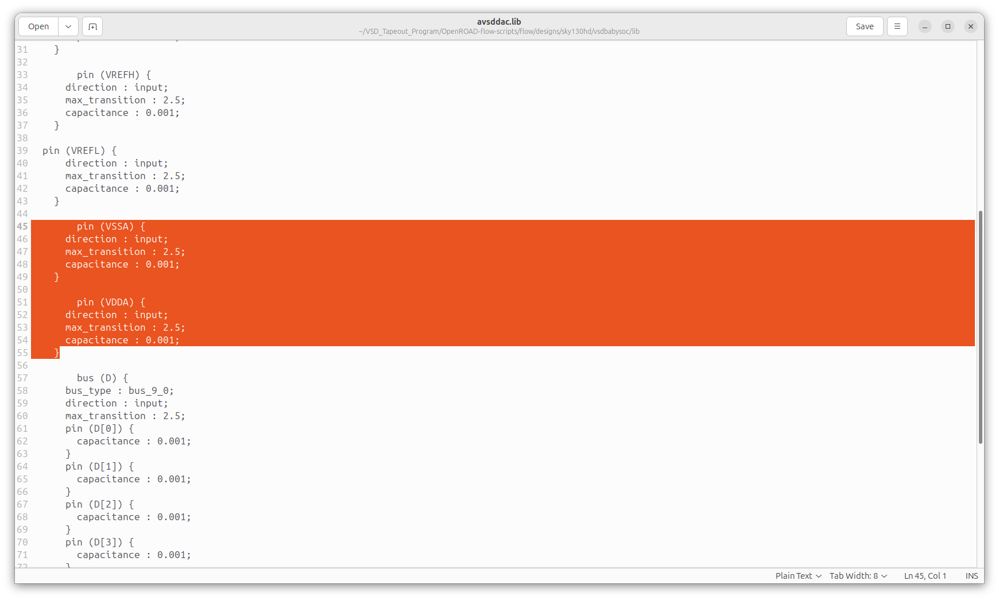
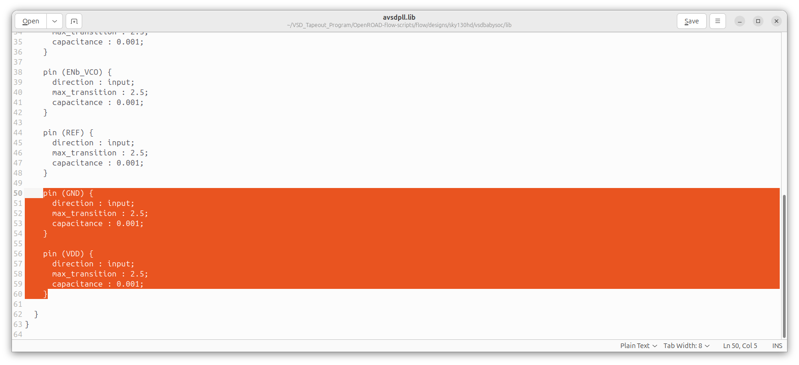

# Week 7: BabySoC Physical Design & Post-Route SPEF Generation 
 
The focus of this week is 

---

## 📜 Table of Contents
[📋 Prerequisites](#-prerequisites) <br>
[1. Overview of ORFS](#1-overview-of-orfs)<br>
[2. Environment Setup and File Organization](#2-environment-setup-and-file-organization)<br>
[3. Synthesis](#3-synthesis)<br>
[4. Floorplan](#4-floorplan)<br>
[5. Placement](#5-placement)<br>
[6. Clock Tree Synthesis (CTS)](#6-clock-tree-synthesis-cts)<br>

---

## 📋 Prerequisites
- Basic understanding of Linux commands.
- Successful installation of the OpenROAD in [Week 5.](https://github.com/BitopanBaishya/VSD-Tapeout-Program-2025---Week-0.git)

---

## 1. Overview of ORFS
This document continues from the conclusion of Week 5.<br>
Following the successful build of the OpenROAD software, the subsequent work begins here.

### <ins>1. ORFS Directory Overview</ins>
OpenROAD is organized into several key directories, each serving a specific role within the OpenROAD and RTL-to-GDSII flow:<br><br>
`OpenROAD-flow-scripts/`: This directory contains the complete flow framework and supporting infrastructure for executing the OpenROAD RTL-to-GDSII flow.
- `docker/`: Contains Docker-based installation files, run scripts, and related components.
- `docs/`: Documentation for OpenROAD and its flow scripts.
- `flow/`: Core files required for running the full RTL-to-GDSII flow.
  * `design/`: Built-in RTL-to-GDSII examples across multiple technology nodes.
  * `makefile`: Automation layer enabling end-to-end flow execution.
  * `platform/`: Technology-specific libraries, LEF files, GDS files, and related resources.
  * `tutorials/`: Reference tutorials demonstrating usage of the flow.
  * `util/`: Helper utilities supporting various flow operations.
  * `scripts/`: Execution scripts used within the flow.
- `jenkins/`: Regression tests associated with build verification and updates.
- `tools/`: All essential tools required to execute the RTL-to-GDSII flow.
- `etc/`: Dependency installers and supporting configuration utilities.
- `setup_env.sh`: Environment setup script used to source OpenROAD rules prior to running the flow.

   <div align="center">
     
   </div>

### <ins>2. Environment Setup and File Organization</ins>
1. Create the two required `vsdbabysoc` design directories:<br>
   ```
   cd /OpenROAD-flow-scripts/flow/
   mkdir -p OpenROAD-flow-scripts/flow/designs/sky130hd/vsdbabysoc
   mkdir -p OpenROAD-flow-scripts/flow/designs/src/vsdbabysoc
   ```

   * **Purpose of the Newly Created Directories**<br>
     * `designs/sky130hd/vsdbabysoc/`: This directory stores all technology-dependent and platform-specific files required for the physical design flow on the Sky130 HD PDK. Contents include:
       * **LEF files** – Abstract layouts for hard macros
       * **LIB files** – Timing libraries for synthesis and STA
       * **GDS files** – Final layout geometries for macros
       * **SDC** – Synthesis constraints
       * **Configuration files** – macro.cfg, pin_order.cfg, config.mk
      * `designs/src/vsdbabysoc/`: This directory holds all logical design sources that remain independent of technology. Contents include:
        * Verilog RTL modules
        * Include headers (`.vh` files)
        * Additional source definitions required during synthesis
     
2. Copy the resource folders from the source location `VSDBabySoC/src` into the `OpenROAD-flow-scripts/flow/designs/sky130hd/vsdbabysoc/` directory you just created.<br>
   Expected contents:<br>
   - `gds/` should include: `avsddac.gds`, `avsdpll.gds`
   - `include/` should include: `sandpiper.vh`, `sandpiper_gen.vh`, `sp_default.vh`, `sp_verilog.vh`
   - `lef/` should include: `avsddac.lef`, `avsdpll.lef`
   - `lib/` should include: `avsddac.lib`, `avsdpll.lib`
3. Copy the SDC constraint file from the source `VSDBabySoC/src/sdc/` to the `OpenROAD-flow-scripts/flow/designs/sky130hd/vsdbabysoc/` directory.
4. Copy the layout configuration files (`macro.cfg` and `pin_order.cfg`) from `VSDBabySoC/src/layout_conf/vsdbabysoc` directory to the `OpenROAD-flow-scripts/flow/designs/sky130hd/vsdbabysoc/` directory.
5. Create a file named `config.mk` inside the `OpenROAD-flow-scripts/flow/designs/sky130hd/vsdbabysoc/` directory with the following contents:
   ```
   export DESIGN_NICKNAME = vsdbabysoc
   export DESIGN_NAME = vsdbabysoc
   export PLATFORM    = sky130hd

   # export VERILOG_FILES_BLACKBOX = $(DESIGN_HOME)/src/$(DESIGN_NICKNAME)/IPs/*.v
   # export VERILOG_FILES = $(sort $(wildcard $(DESIGN_HOME)/src/$(DESIGN_NICKNAME)/*.v))
   # Explicitly list the Verilog files for synthesis
   export VERILOG_FILES = $(DESIGN_HOME)/src/$(DESIGN_NICKNAME)/vsdbabysoc.v \
                          $(DESIGN_HOME)/src/$(DESIGN_NICKNAME)/rvmyth.v \
                          $(DESIGN_HOME)/src/$(DESIGN_NICKNAME)/clk_gate.v

   export SDC_FILE      = $(DESIGN_HOME)/$(PLATFORM)/$(DESIGN_NICKNAME)/vsdbabysoc_synthesis.sdc

   export vsdbabysoc_DIR = $(DESIGN_HOME)/$(PLATFORM)/$(DESIGN_NICKNAME)

   export VERILOG_INCLUDE_DIRS = $(wildcard $(vsdbabysoc_DIR)/include/)
   # export SDC_FILE      = $(wildcard $(vsdbabysoc_DIR)/sdc/*.sdc)
   export ADDITIONAL_GDS  = $(wildcard $(vsdbabysoc_DIR)/gds/*.gds.gz)
   export ADDITIONAL_LEFS  = $(wildcard $(vsdbabysoc_DIR)/lef/*.lef)
   export ADDITIONAL_LIBS = $(wildcard $(vsdbabysoc_DIR)/lib/*.lib)
   # export PDN_TCL = $(DESIGN_HOME)/$(PLATFORM)/$(DESIGN_NICKNAME)/pdn.tcl

   # Clock Configuration (vsdbabysoc specific)
   # export CLOCK_PERIOD = 20.0
   export CLOCK_PORT = CLK
   export CLOCK_NET = $(CLOCK_PORT)

   # Floorplanning Configuration (vsdbabysoc specific)
   export FP_PIN_ORDER_CFG = $(wildcard $(DESIGN_DIR)/pin_order.cfg)
   # export FP_SIZING = absolute

   export DIE_AREA   = 0 0 1600 1600
   export CORE_AREA  = 20 20 1590 1590

   # Placement Configuration (vsdbabysoc specific)
   export MACRO_PLACEMENT_CFG = $(wildcard $(DESIGN_DIR)/macro.cfg)
   export PLACE_PINS_ARGS = -exclude left:0-600 -exclude left:1000-1600: -exclude right:* -exclude top:* -exclude bottom:*
   # export MACRO_PLACEMENT = $(DESIGN_HOME)/$(PLATFORM)/$(DESIGN_NICKNAME)/macro_placement.cfg

   export TNS_END_PERCENT = 100
   export REMOVE_ABC_BUFFERS = 1

   # Magic Tool Configuration
   export MAGIC_ZEROIZE_ORIGIN = 0
   export MAGIC_EXT_USE_GDS = 1

   # CTS tuning
   export CTS_BUF_DISTANCE = 600
   export SKIP_GATE_CLONING = 1

   # export CORE_UTILIZATION=0.1  # Reduce this value to allow more whitespace for routing.
   ```

6. Now copy the following files from `VSDBabySoC/src/module/` to `OpenROAD-flow-scripts/flow/designs/src/vsdbabysoc`:
   * `vsdbabysoc.v`
   * `rvmyth.v`
   * `rvmyth_gen.v`
   * `clk_gate.v`
   * `avsddac.v`
   * `avsdpll.v`
8. The final structure of directories and files should look like below:
   ```
   designs/
   ├── src/vsdbabysoc/
   │           ├── vsdbabysoc.v
   │           ├── rvmyth.v
   │           ├── rvmyth_gen.v
   │           ├── clk_gate.v
   │           ├── avsddac.v
   │           └── avsdpll.v
   └── sky130hd/vsdbabysoc/
                    ├── gds/
                    │   ├── avsddac.gds
                    │   └── avsdpll.gds
                    ├── lef/
                    │   ├── avsddac.lef
                    │   └── avsdpll.lef
                    ├── lib/
                    │   ├── avsddac.lib
                    │   └── avsdpll.lib
                    └── include/
                    │   ├── sandpiper.vh
                    │   ├── sandpiper_gen.vh
                    │   ├── sp_default.vh
                    │   └── sp_verilog.vh
                    ├── macro.cfg
                    ├── pin_order.cfg
                    ├── config.mk
                    └── vsdbabysoc_synthesis.sdc
   ```

> [!CAUTION]
> The following files are needed to be modified to avoid parsing errors:
> 1. File name: `avsddac.lib`<br>
>    Before:
>    <div align="center">
>    
>    </div>
>    
>    Replace with:
>    ```
>    pg_pin (VSSA) {
>      voltage_name : VSSA;
>      pg_type : primary_ground;
>    }
>    
>    pg_pin (VDDA) {
>      voltage_name : VDDA;
>      pg_type : primary_power;
>    }
>    ```
> 2. File name: `avsdpll.lib`<br>
>    Before:
>    <div align="center">
>    
>    </div>
>    
>    Replace with:
>    ```
>    pg_pin (GND) {
>      voltage_name : GND;
>      pg_type : primary_ground;
>    }
>    
>    pg_pin (VDD) {
>      voltage_name : VDD;
>      pg_type : primary_power;
>    }
>    ```

---

## 3. Synthesis

### <ins>1. Commands</ins>
First run the following commands:
```
cd OpenROAD-flow-scripts
source env.sh
cd flow
```

Now, execute synthesis:
```
make DESIGN_CONFIG=./designs/sky130hd/vsdbabysoc/config.mk synth
```

### <ins>2. Execution of Synthesis in the Terminal</ins>
<div align="center">

</div>
<div align="center">

</div>

### <ins>3. Synthesized Netlist</ins>
<div align="center">

</div>

### <ins>4. Synthesis Log</ins>
<div align="center">

</div>

### <ins>5. Synthesis Check</ins>
<div align="center">

</div>

### <ins>6. Synthesis Stats</ins>
<div align="center">

</div>
<div align="center">

</div>
<div align="center">

</div>

---

## 4. Floorplan
### <ins>1. Commands</ins>
Now, execute floorplan:
```
make DESIGN_CONFIG=./designs/sky130hd/vsdbabysoc/config.mk floorplan
```

### <ins>2. Execution of Floorplan in the Terminal</ins>
<div align="center">

</div>
<div align="center">

</div>
<div align="center">

</div>

### <ins>3. Visualize Floorplan</ins>
```
make DESIGN_CONFIG=./designs/sky130hd/vsdbabysoc/config.mk gui_floorplan
```
<div align="center">

</div>

<div align="center">

</div>

---

## 5. Placement
### <ins>1. Commands</ins>
Now, execute floorplan:
```
make DESIGN_CONFIG=./designs/sky130hd/vsdbabysoc/config.mk place
```

### <ins>2. Execution of Placement in the Terminal</ins>
<div align="center">

</div>
<div align="center">

</div>

### <ins>3. Visualize Floorplan</ins>
```
make DESIGN_CONFIG=./designs/sky130hd/vsdbabysoc/config.mk gui_place
```

<div align="center">

</div>
<div align="center">

</div>

Heatmap:
<div align="center">

</div>

Zooming into the different parts:
<div align="center">

</div>
<div align="center">

</div>
<div align="center">

</div>
<div align="center">

</div>

---

## 6. Clock Tree Synthesis (CTS)
### <ins>1. Commands</ins>
Now, execute cts:
```
make DESIGN_CONFIG=./designs/sky130hd/vsdbabysoc/config.mk cts
```

### <ins>2. Execution of CTS in the Terminal</ins>
<div align="center">

</div>
<div align="center">

</div>

### <ins>3. Visualize CTS</ins>
```
make DESIGN_CONFIG=./designs/sky130hd/vsdbabysoc/config.mk gui_cts
```

<div align="center">

</div>
<div align="center">

</div>
<div align="center">

</div>
<div align="center">

</div>

### <ins>4. Final CTS Report</ins>
```
==========================================================================
cts final report_tns
--------------------------------------------------------------------------
tns max 0.00

==========================================================================
cts final report_wns
--------------------------------------------------------------------------
wns max 0.00

==========================================================================
cts final report_worst_slack
--------------------------------------------------------------------------
worst slack max 5.31

==========================================================================
cts final report_clock_min_period
--------------------------------------------------------------------------
clk period_min = 5.69 fmax = 175.83

==========================================================================
cts final report_clock_skew
--------------------------------------------------------------------------
Clock clk
   0.97 source latency core.CPU_src2_value_a4[28]$_DFF_P_/CLK ^
  -0.86 target latency core.CPU_Dmem_value_a5[14][28]$_SDFFE_PP0P_/CLK ^
   0.00 CRPR
--------------
   0.11 setup skew


==========================================================================
cts final report_checks -path_delay min
--------------------------------------------------------------------------
Startpoint: core.CPU_rd_a2[4]$_DFF_P_
            (rising edge-triggered flip-flop clocked by clk)
Endpoint: core.CPU_rd_a3[4]$_DFF_P_
          (rising edge-triggered flip-flop clocked by clk)
Path Group: clk
Path Type: min

Fanout     Cap    Slew   Delay    Time   Description
-----------------------------------------------------------------------------
                          0.00    0.00   clock clk (rise edge)
                          0.00    0.00   clock source latency
     1    0.21    0.00    0.00    0.00 ^ pll/CLK (avsdpll)
                                         CLK (net)
                  0.02    0.01    0.01 ^ clkbuf_0_CLK/A (sky130_fd_sc_hd__clkbuf_16)
     8    0.35    0.36    0.34    0.36 ^ clkbuf_0_CLK/X (sky130_fd_sc_hd__clkbuf_16)
                                         clknet_0_CLK (net)
                  0.36    0.02    0.37 ^ clkbuf_3_6__f_CLK/A (sky130_fd_sc_hd__clkbuf_16)
    10    0.17    0.19    0.33    0.70 ^ clkbuf_3_6__f_CLK/X (sky130_fd_sc_hd__clkbuf_16)
                                         clknet_3_6__leaf_CLK (net)
                  0.19    0.00    0.70 ^ clkbuf_leaf_9_CLK/A (sky130_fd_sc_hd__clkbuf_16)
    18    0.06    0.08    0.20    0.91 ^ clkbuf_leaf_9_CLK/X (sky130_fd_sc_hd__clkbuf_16)
                                         clknet_leaf_9_CLK (net)
                  0.08    0.00    0.91 ^ core.CPU_rd_a2[4]$_DFF_P_/CLK (sky130_fd_sc_hd__dfxtp_1)
     1    0.00    0.04    0.31    1.22 ^ core.CPU_rd_a2[4]$_DFF_P_/Q (sky130_fd_sc_hd__dfxtp_1)
                                         core.CPU_rd_a2[4] (net)
                  0.04    0.00    1.22 ^ core.CPU_rd_a3[4]$_DFF_P_/D (sky130_fd_sc_hd__dfxtp_1)
                                  1.22   data arrival time

                          0.00    0.00   clock clk (rise edge)
                          0.00    0.00   clock source latency
     1    0.21    0.00    0.00    0.00 ^ pll/CLK (avsdpll)
                                         CLK (net)
                  0.02    0.01    0.01 ^ clkbuf_0_CLK/A (sky130_fd_sc_hd__clkbuf_16)
     8    0.35    0.36    0.34    0.36 ^ clkbuf_0_CLK/X (sky130_fd_sc_hd__clkbuf_16)
                                         clknet_0_CLK (net)
                  0.36    0.02    0.37 ^ clkbuf_3_7__f_CLK/A (sky130_fd_sc_hd__clkbuf_16)
    13    0.19    0.21    0.34    0.71 ^ clkbuf_3_7__f_CLK/X (sky130_fd_sc_hd__clkbuf_16)
                                         clknet_3_7__leaf_CLK (net)
                  0.21    0.00    0.72 ^ clkbuf_leaf_8_CLK/A (sky130_fd_sc_hd__clkbuf_16)
    17    0.06    0.08    0.21    0.93 ^ clkbuf_leaf_8_CLK/X (sky130_fd_sc_hd__clkbuf_16)
                                         clknet_leaf_8_CLK (net)
                  0.08    0.00    0.93 ^ core.CPU_rd_a3[4]$_DFF_P_/CLK (sky130_fd_sc_hd__dfxtp_1)
                          0.00    0.93   clock reconvergence pessimism
                         -0.03    0.90   library hold time
                                  0.90   data required time
-----------------------------------------------------------------------------
                                  0.90   data required time
                                 -1.22   data arrival time
-----------------------------------------------------------------------------
                                  0.32   slack (MET)


==========================================================================
cts final report_checks -path_delay max
--------------------------------------------------------------------------
Startpoint: core.CPU_src2_value_a3[22]$_DFF_P_
            (rising edge-triggered flip-flop clocked by clk)
Endpoint: core.CPU_Xreg_value_a4[27][29]$_SDFFE_PP0P_
          (rising edge-triggered flip-flop clocked by clk)
Path Group: clk
Path Type: max

Fanout     Cap    Slew   Delay    Time   Description
-----------------------------------------------------------------------------
                          0.00    0.00   clock clk (rise edge)
                          0.00    0.00   clock source latency
     1    0.21    0.00    0.00    0.00 ^ pll/CLK (avsdpll)
                                         CLK (net)
                  0.02    0.01    0.01 ^ clkbuf_0_CLK/A (sky130_fd_sc_hd__clkbuf_16)
     8    0.35    0.36    0.34    0.36 ^ clkbuf_0_CLK/X (sky130_fd_sc_hd__clkbuf_16)
                                         clknet_0_CLK (net)
                  0.36    0.02    0.37 ^ clkbuf_3_6__f_CLK/A (sky130_fd_sc_hd__clkbuf_16)
    10    0.17    0.19    0.33    0.70 ^ clkbuf_3_6__f_CLK/X (sky130_fd_sc_hd__clkbuf_16)
                                         clknet_3_6__leaf_CLK (net)
                  0.19    0.00    0.70 ^ clkbuf_leaf_24_CLK/A (sky130_fd_sc_hd__clkbuf_16)
     5    0.05    0.07    0.20    0.90 ^ clkbuf_leaf_24_CLK/X (sky130_fd_sc_hd__clkbuf_16)
                                         clknet_leaf_24_CLK (net)
                  0.07    0.00    0.90 ^ core.CPU_src2_value_a3[22]$_DFF_P_/CLK (sky130_fd_sc_hd__dfxtp_1)
     3    0.12    1.09    1.04    1.94 ^ core.CPU_src2_value_a3[22]$_DFF_P_/Q (sky130_fd_sc_hd__dfxtp_1)
                                         core.CPU_src2_value_a3[22] (net)
                  1.09    0.03    1.97 ^ _05544_/A (sky130_fd_sc_hd__inv_1)
     1    0.00    0.15    0.11    2.08 v _05544_/Y (sky130_fd_sc_hd__inv_1)
                                         _00158_ (net)
                  0.15    0.00    2.08 v _10861_/B (sky130_fd_sc_hd__ha_1)
    12    0.07    0.60    0.72    2.79 ^ _10861_/SUM (sky130_fd_sc_hd__ha_1)
                                         _00160_ (net)
                  0.60    0.00    2.80 ^ _08166_/A (sky130_fd_sc_hd__inv_1)
     3    0.01    0.14    0.15    2.95 v _08166_/Y (sky130_fd_sc_hd__inv_1)
                                         _03244_ (net)
                  0.14    0.00    2.95 v _08168_/A2 (sky130_fd_sc_hd__a21oi_1)
     5    0.04    0.72    0.63    3.57 ^ _08168_/Y (sky130_fd_sc_hd__a21oi_1)
                                         _03246_ (net)
                  0.72    0.00    3.57 ^ _08419_/A1 (sky130_fd_sc_hd__o211ai_1)
     1    0.01    0.19    0.27    3.84 v _08419_/Y (sky130_fd_sc_hd__o211ai_1)
                                         _03491_ (net)
                  0.19    0.00    3.84 v _08423_/B1 (sky130_fd_sc_hd__a221o_1)
     3    0.02    0.11    0.41    4.25 v _08423_/X (sky130_fd_sc_hd__a221o_1)
                                         _03495_ (net)
                  0.11    0.00    4.25 v _08425_/A (sky130_fd_sc_hd__nor2_1)
     1    0.00    0.11    0.14    4.39 ^ _08425_/Y (sky130_fd_sc_hd__nor2_1)
                                         _03497_ (net)
                  0.11    0.00    4.39 ^ _08430_/A3 (sky130_fd_sc_hd__a31oi_1)
     1    0.01    0.26    0.16    4.55 v _08430_/Y (sky130_fd_sc_hd__a31oi_1)
                                         _03502_ (net)
                  0.26    0.00    4.55 v _08434_/A2 (sky130_fd_sc_hd__a31oi_1)
     1    0.06    1.31    1.10    5.66 ^ _08434_/Y (sky130_fd_sc_hd__a31oi_1)
                                         _03506_ (net)
                  1.31    0.01    5.67 ^ place321/A (sky130_fd_sc_hd__buf_4)
     3    0.01    0.07    0.27    5.94 ^ place321/X (sky130_fd_sc_hd__buf_4)
                                         net320 (net)
                  0.07    0.00    5.94 ^ _08450_/A2 (sky130_fd_sc_hd__o31ai_1)
     2    0.01    0.12    0.10    6.03 v _08450_/Y (sky130_fd_sc_hd__o31ai_1)
                                         _03522_ (net)
                  0.12    0.00    6.03 v _08451_/B (sky130_fd_sc_hd__nand2_1)
    10    0.03    0.29    0.27    6.30 ^ _08451_/Y (sky130_fd_sc_hd__nand2_1)
                                         _03523_ (net)
                  0.29    0.00    6.30 ^ _09231_/A1 (sky130_fd_sc_hd__o21ai_0)
     1    0.00    0.12    0.15    6.45 v _09231_/Y (sky130_fd_sc_hd__o21ai_0)
                                         _00965_ (net)
                  0.12    0.00    6.45 v core.CPU_Xreg_value_a4[27][29]$_SDFFE_PP0P_/D (sky130_fd_sc_hd__dfxtp_1)
                                  6.45   data arrival time

                         11.00   11.00   clock clk (rise edge)
                          0.00   11.00   clock source latency
     1    0.21    0.00    0.00   11.00 ^ pll/CLK (avsdpll)
                                         CLK (net)
                  0.02    0.01   11.01 ^ clkbuf_0_CLK/A (sky130_fd_sc_hd__clkbuf_16)
     8    0.35    0.36    0.34   11.36 ^ clkbuf_0_CLK/X (sky130_fd_sc_hd__clkbuf_16)
                                         clknet_0_CLK (net)
                  0.36    0.02   11.37 ^ clkbuf_3_5__f_CLK/A (sky130_fd_sc_hd__clkbuf_16)
    11    0.18    0.19    0.33   11.70 ^ clkbuf_3_5__f_CLK/X (sky130_fd_sc_hd__clkbuf_16)
                                         clknet_3_5__leaf_CLK (net)
                  0.19    0.00   11.70 ^ clkbuf_leaf_31_CLK/A (sky130_fd_sc_hd__clkbuf_16)
    12    0.05    0.07    0.20   11.90 ^ clkbuf_leaf_31_CLK/X (sky130_fd_sc_hd__clkbuf_16)
                                         clknet_leaf_31_CLK (net)
                  0.07    0.00   11.90 ^ core.CPU_Xreg_value_a4[27][29]$_SDFFE_PP0P_/CLK (sky130_fd_sc_hd__dfxtp_1)
                          0.00   11.90   clock reconvergence pessimism
                         -0.14   11.76   library setup time
                                 11.76   data required time
-----------------------------------------------------------------------------
                                 11.76   data required time
                                 -6.45   data arrival time
-----------------------------------------------------------------------------
                                  5.31   slack (MET)


==========================================================================
cts final report_checks -unconstrained
--------------------------------------------------------------------------
Startpoint: core.CPU_src2_value_a3[22]$_DFF_P_
            (rising edge-triggered flip-flop clocked by clk)
Endpoint: core.CPU_Xreg_value_a4[27][29]$_SDFFE_PP0P_
          (rising edge-triggered flip-flop clocked by clk)
Path Group: clk
Path Type: max

Fanout     Cap    Slew   Delay    Time   Description
-----------------------------------------------------------------------------
                          0.00    0.00   clock clk (rise edge)
                          0.00    0.00   clock source latency
     1    0.21    0.00    0.00    0.00 ^ pll/CLK (avsdpll)
                                         CLK (net)
                  0.02    0.01    0.01 ^ clkbuf_0_CLK/A (sky130_fd_sc_hd__clkbuf_16)
     8    0.35    0.36    0.34    0.36 ^ clkbuf_0_CLK/X (sky130_fd_sc_hd__clkbuf_16)
                                         clknet_0_CLK (net)
                  0.36    0.02    0.37 ^ clkbuf_3_6__f_CLK/A (sky130_fd_sc_hd__clkbuf_16)
    10    0.17    0.19    0.33    0.70 ^ clkbuf_3_6__f_CLK/X (sky130_fd_sc_hd__clkbuf_16)
                                         clknet_3_6__leaf_CLK (net)
                  0.19    0.00    0.70 ^ clkbuf_leaf_24_CLK/A (sky130_fd_sc_hd__clkbuf_16)
     5    0.05    0.07    0.20    0.90 ^ clkbuf_leaf_24_CLK/X (sky130_fd_sc_hd__clkbuf_16)
                                         clknet_leaf_24_CLK (net)
                  0.07    0.00    0.90 ^ core.CPU_src2_value_a3[22]$_DFF_P_/CLK (sky130_fd_sc_hd__dfxtp_1)
     3    0.12    1.09    1.04    1.94 ^ core.CPU_src2_value_a3[22]$_DFF_P_/Q (sky130_fd_sc_hd__dfxtp_1)
                                         core.CPU_src2_value_a3[22] (net)
                  1.09    0.03    1.97 ^ _05544_/A (sky130_fd_sc_hd__inv_1)
     1    0.00    0.15    0.11    2.08 v _05544_/Y (sky130_fd_sc_hd__inv_1)
                                         _00158_ (net)
                  0.15    0.00    2.08 v _10861_/B (sky130_fd_sc_hd__ha_1)
    12    0.07    0.60    0.72    2.79 ^ _10861_/SUM (sky130_fd_sc_hd__ha_1)
                                         _00160_ (net)
                  0.60    0.00    2.80 ^ _08166_/A (sky130_fd_sc_hd__inv_1)
     3    0.01    0.14    0.15    2.95 v _08166_/Y (sky130_fd_sc_hd__inv_1)
                                         _03244_ (net)
                  0.14    0.00    2.95 v _08168_/A2 (sky130_fd_sc_hd__a21oi_1)
     5    0.04    0.72    0.63    3.57 ^ _08168_/Y (sky130_fd_sc_hd__a21oi_1)
                                         _03246_ (net)
                  0.72    0.00    3.57 ^ _08419_/A1 (sky130_fd_sc_hd__o211ai_1)
     1    0.01    0.19    0.27    3.84 v _08419_/Y (sky130_fd_sc_hd__o211ai_1)
                                         _03491_ (net)
                  0.19    0.00    3.84 v _08423_/B1 (sky130_fd_sc_hd__a221o_1)
     3    0.02    0.11    0.41    4.25 v _08423_/X (sky130_fd_sc_hd__a221o_1)
                                         _03495_ (net)
                  0.11    0.00    4.25 v _08425_/A (sky130_fd_sc_hd__nor2_1)
     1    0.00    0.11    0.14    4.39 ^ _08425_/Y (sky130_fd_sc_hd__nor2_1)
                                         _03497_ (net)
                  0.11    0.00    4.39 ^ _08430_/A3 (sky130_fd_sc_hd__a31oi_1)
     1    0.01    0.26    0.16    4.55 v _08430_/Y (sky130_fd_sc_hd__a31oi_1)
                                         _03502_ (net)
                  0.26    0.00    4.55 v _08434_/A2 (sky130_fd_sc_hd__a31oi_1)
     1    0.06    1.31    1.10    5.66 ^ _08434_/Y (sky130_fd_sc_hd__a31oi_1)
                                         _03506_ (net)
                  1.31    0.01    5.67 ^ place321/A (sky130_fd_sc_hd__buf_4)
     3    0.01    0.07    0.27    5.94 ^ place321/X (sky130_fd_sc_hd__buf_4)
                                         net320 (net)
                  0.07    0.00    5.94 ^ _08450_/A2 (sky130_fd_sc_hd__o31ai_1)
     2    0.01    0.12    0.10    6.03 v _08450_/Y (sky130_fd_sc_hd__o31ai_1)
                                         _03522_ (net)
                  0.12    0.00    6.03 v _08451_/B (sky130_fd_sc_hd__nand2_1)
    10    0.03    0.29    0.27    6.30 ^ _08451_/Y (sky130_fd_sc_hd__nand2_1)
                                         _03523_ (net)
                  0.29    0.00    6.30 ^ _09231_/A1 (sky130_fd_sc_hd__o21ai_0)
     1    0.00    0.12    0.15    6.45 v _09231_/Y (sky130_fd_sc_hd__o21ai_0)
                                         _00965_ (net)
                  0.12    0.00    6.45 v core.CPU_Xreg_value_a4[27][29]$_SDFFE_PP0P_/D (sky130_fd_sc_hd__dfxtp_1)
                                  6.45   data arrival time

                         11.00   11.00   clock clk (rise edge)
                          0.00   11.00   clock source latency
     1    0.21    0.00    0.00   11.00 ^ pll/CLK (avsdpll)
                                         CLK (net)
                  0.02    0.01   11.01 ^ clkbuf_0_CLK/A (sky130_fd_sc_hd__clkbuf_16)
     8    0.35    0.36    0.34   11.36 ^ clkbuf_0_CLK/X (sky130_fd_sc_hd__clkbuf_16)
                                         clknet_0_CLK (net)
                  0.36    0.02   11.37 ^ clkbuf_3_5__f_CLK/A (sky130_fd_sc_hd__clkbuf_16)
    11    0.18    0.19    0.33   11.70 ^ clkbuf_3_5__f_CLK/X (sky130_fd_sc_hd__clkbuf_16)
                                         clknet_3_5__leaf_CLK (net)
                  0.19    0.00   11.70 ^ clkbuf_leaf_31_CLK/A (sky130_fd_sc_hd__clkbuf_16)
    12    0.05    0.07    0.20   11.90 ^ clkbuf_leaf_31_CLK/X (sky130_fd_sc_hd__clkbuf_16)
                                         clknet_leaf_31_CLK (net)
                  0.07    0.00   11.90 ^ core.CPU_Xreg_value_a4[27][29]$_SDFFE_PP0P_/CLK (sky130_fd_sc_hd__dfxtp_1)
                          0.00   11.90   clock reconvergence pessimism
                         -0.14   11.76   library setup time
                                 11.76   data required time
-----------------------------------------------------------------------------
                                 11.76   data required time
                                 -6.45   data arrival time
-----------------------------------------------------------------------------
                                  5.31   slack (MET)


==========================================================================
cts final report_check_types -max_slew -max_cap -max_fanout -violators
--------------------------------------------------------------------------

==========================================================================
cts final max_slew_check_slack
--------------------------------------------------------------------------
0.03764066845178604

==========================================================================
cts final max_slew_check_limit
--------------------------------------------------------------------------
1.510388970375061

==========================================================================
cts final max_slew_check_slack_limit
--------------------------------------------------------------------------
0.0249

==========================================================================
cts final max_fanout_check_slack
--------------------------------------------------------------------------
1.0000000150474662e+30

==========================================================================
cts final max_fanout_check_limit
--------------------------------------------------------------------------
1.0000000150474662e+30

==========================================================================
cts final max_capacitance_check_slack
--------------------------------------------------------------------------
0.0011702997144311666

==========================================================================
cts final max_capacitance_check_limit
--------------------------------------------------------------------------
0.021067000925540924

==========================================================================
cts final max_capacitance_check_slack_limit
--------------------------------------------------------------------------
0.0556

==========================================================================
cts final max_slew_violation_count
--------------------------------------------------------------------------
max slew violation count 0

==========================================================================
cts final max_fanout_violation_count
--------------------------------------------------------------------------
max fanout violation count 0

==========================================================================
cts final max_cap_violation_count
--------------------------------------------------------------------------
max cap violation count 0

==========================================================================
cts final setup_violation_count
--------------------------------------------------------------------------
setup violation count 0

==========================================================================
cts final hold_violation_count
--------------------------------------------------------------------------
hold violation count 0

==========================================================================
cts final report_checks -path_delay max reg to reg
--------------------------------------------------------------------------
Startpoint: core.CPU_src2_value_a3[22]$_DFF_P_
            (rising edge-triggered flip-flop clocked by clk)
Endpoint: core.CPU_Xreg_value_a4[27][29]$_SDFFE_PP0P_
          (rising edge-triggered flip-flop clocked by clk)
Path Group: clk
Path Type: max

  Delay    Time   Description
---------------------------------------------------------
   0.00    0.00   clock clk (rise edge)
   0.00    0.00   clock source latency
   0.00    0.00 ^ pll/CLK (avsdpll)
   0.36    0.36 ^ clkbuf_0_CLK/X (sky130_fd_sc_hd__clkbuf_16)
   0.35    0.70 ^ clkbuf_3_6__f_CLK/X (sky130_fd_sc_hd__clkbuf_16)
   0.20    0.90 ^ clkbuf_leaf_24_CLK/X (sky130_fd_sc_hd__clkbuf_16)
   0.00    0.90 ^ core.CPU_src2_value_a3[22]$_DFF_P_/CLK (sky130_fd_sc_hd__dfxtp_1)
   1.04    1.94 ^ core.CPU_src2_value_a3[22]$_DFF_P_/Q (sky130_fd_sc_hd__dfxtp_1)
   0.14    2.08 v _05544_/Y (sky130_fd_sc_hd__inv_1)
   0.72    2.79 ^ _10861_/SUM (sky130_fd_sc_hd__ha_1)
   0.15    2.95 v _08166_/Y (sky130_fd_sc_hd__inv_1)
   0.63    3.57 ^ _08168_/Y (sky130_fd_sc_hd__a21oi_1)
   0.27    3.84 v _08419_/Y (sky130_fd_sc_hd__o211ai_1)
   0.41    4.25 v _08423_/X (sky130_fd_sc_hd__a221o_1)
   0.14    4.39 ^ _08425_/Y (sky130_fd_sc_hd__nor2_1)
   0.16    4.55 v _08430_/Y (sky130_fd_sc_hd__a31oi_1)
   1.10    5.66 ^ _08434_/Y (sky130_fd_sc_hd__a31oi_1)
   0.28    5.94 ^ place321/X (sky130_fd_sc_hd__buf_4)
   0.10    6.03 v _08450_/Y (sky130_fd_sc_hd__o31ai_1)
   0.27    6.30 ^ _08451_/Y (sky130_fd_sc_hd__nand2_1)
   0.15    6.45 v _09231_/Y (sky130_fd_sc_hd__o21ai_0)
   0.00    6.45 v core.CPU_Xreg_value_a4[27][29]$_SDFFE_PP0P_/D (sky130_fd_sc_hd__dfxtp_1)
           6.45   data arrival time

  11.00   11.00   clock clk (rise edge)
   0.00   11.00   clock source latency
   0.00   11.00 ^ pll/CLK (avsdpll)
   0.36   11.36 ^ clkbuf_0_CLK/X (sky130_fd_sc_hd__clkbuf_16)
   0.34   11.70 ^ clkbuf_3_5__f_CLK/X (sky130_fd_sc_hd__clkbuf_16)
   0.20   11.90 ^ clkbuf_leaf_31_CLK/X (sky130_fd_sc_hd__clkbuf_16)
   0.00   11.90 ^ core.CPU_Xreg_value_a4[27][29]$_SDFFE_PP0P_/CLK (sky130_fd_sc_hd__dfxtp_1)
   0.00   11.90   clock reconvergence pessimism
  -0.14   11.76   library setup time
          11.76   data required time
---------------------------------------------------------
          11.76   data required time
          -6.45   data arrival time
---------------------------------------------------------
           5.31   slack (MET)


==========================================================================
cts final report_checks -path_delay min reg to reg
--------------------------------------------------------------------------
Startpoint: core.CPU_rd_a2[4]$_DFF_P_
            (rising edge-triggered flip-flop clocked by clk)
Endpoint: core.CPU_rd_a3[4]$_DFF_P_
          (rising edge-triggered flip-flop clocked by clk)
Path Group: clk
Path Type: min

  Delay    Time   Description
---------------------------------------------------------
   0.00    0.00   clock clk (rise edge)
   0.00    0.00   clock source latency
   0.00    0.00 ^ pll/CLK (avsdpll)
   0.36    0.36 ^ clkbuf_0_CLK/X (sky130_fd_sc_hd__clkbuf_16)
   0.35    0.70 ^ clkbuf_3_6__f_CLK/X (sky130_fd_sc_hd__clkbuf_16)
   0.21    0.91 ^ clkbuf_leaf_9_CLK/X (sky130_fd_sc_hd__clkbuf_16)
   0.00    0.91 ^ core.CPU_rd_a2[4]$_DFF_P_/CLK (sky130_fd_sc_hd__dfxtp_1)
   0.31    1.22 ^ core.CPU_rd_a2[4]$_DFF_P_/Q (sky130_fd_sc_hd__dfxtp_1)
   0.00    1.22 ^ core.CPU_rd_a3[4]$_DFF_P_/D (sky130_fd_sc_hd__dfxtp_1)
           1.22   data arrival time

   0.00    0.00   clock clk (rise edge)
   0.00    0.00   clock source latency
   0.00    0.00 ^ pll/CLK (avsdpll)
   0.36    0.36 ^ clkbuf_0_CLK/X (sky130_fd_sc_hd__clkbuf_16)
   0.36    0.71 ^ clkbuf_3_7__f_CLK/X (sky130_fd_sc_hd__clkbuf_16)
   0.21    0.93 ^ clkbuf_leaf_8_CLK/X (sky130_fd_sc_hd__clkbuf_16)
   0.00    0.93 ^ core.CPU_rd_a3[4]$_DFF_P_/CLK (sky130_fd_sc_hd__dfxtp_1)
   0.00    0.93   clock reconvergence pessimism
  -0.03    0.90   library hold time
           0.90   data required time
---------------------------------------------------------
           0.90   data required time
          -1.22   data arrival time
---------------------------------------------------------
           0.32   slack (MET)


==========================================================================
cts final critical path target clock latency max path
--------------------------------------------------------------------------
0

==========================================================================
cts final critical path target clock latency min path
--------------------------------------------------------------------------
0

==========================================================================
cts final critical path source clock latency min path
--------------------------------------------------------------------------
0

==========================================================================
cts final critical path delay
--------------------------------------------------------------------------
6.4490

==========================================================================
cts final critical path slack
--------------------------------------------------------------------------
5.3127

==========================================================================
cts final slack div critical path delay
--------------------------------------------------------------------------
82.380214

==========================================================================
cts final report_power
--------------------------------------------------------------------------
Group                  Internal  Switching    Leakage      Total
                          Power      Power      Power      Power (Watts)
----------------------------------------------------------------
Sequential             4.36e-03   4.18e-04   9.27e-09   4.78e-03  39.5%
Combinational          9.85e-04   2.77e-03   1.03e-08   3.75e-03  31.0%
Clock                  1.71e-03   1.87e-03   1.44e-09   3.58e-03  29.6%
Macro                  0.00e+00   0.00e+00   0.00e+00   0.00e+00   0.0%
Pad                    0.00e+00   0.00e+00   0.00e+00   0.00e+00   0.0%
----------------------------------------------------------------
Total                  7.06e-03   5.05e-03   2.10e-08   1.21e-02 100.0%
                          58.3%      41.7%       0.0%
```


